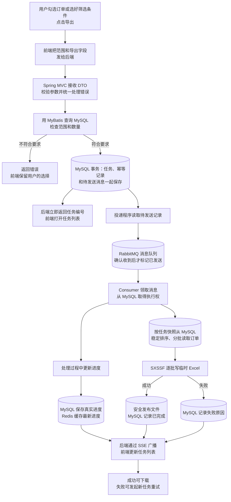

# 订单导出：从点击按钮到拿到文件

这是一份帮助理解后端工作顺序的学习稿，不是已经运行的系统说明，也不是获批的功能规格。项目目前只有规则和设计文档，还没有前后端实现。

## 一张图看完整过程

可以把它想成“提交申请”和“后台办事”两段。用户点击导出后，后端先**登记任务并立即回复**；真正生成 Excel 的工作在后台继续。因此“创建任务成功”不等于“文件已经做好”。

## 按时间顺序看后端做了什么

假设用户要导出 1,000 条订单，并选择了“订单号、金额、下单时间”三列。

1. **接收申请。**前端发送导出范围和列名。范围可以是勾选的订单 ID，也可以是当前筛选条件命中的**所有**订单，不只是屏幕上的这一页。后端先把请求内容接收为一个 DTO。DTO 可以简单理解为“装着前端所填数据的临时表单”，不是数据库中的任务记录。
2. **检查申请。**后端确认范围和字段是否合法、实际会导出多少条，且没有超过 200,000 条。它还会识别同一次提交的网络重试，避免用户因超时再点一次就产生两个文件。前端做过检查，后端仍要自己再检查。
3. **登记任务。**检查通过后，MySQL 保存一条任务记录：任务编号、导出范围、列的顺序、总条数和“等待中”状态。同时保存防重复提交的信息，并记下“这项任务需要排队”。这几件事一起成功或一起失败，不会只登记任务却忘了排队意图。
4. **先回复用户。**数据库登记成功，后端就把任务编号和当前状态返回给前端。前端转到任务列表，用户可以离开页面；后台工作不会因此取消。此时 Excel 通常还没有生成。
5. **送进消息队列。**投递程序读取 MySQL 的待发送记录，发给 RabbitMQ。RabbitMQ 确认收到并正确投递后，才标记这条记录已发送。暂时发送失败就保留记录，稍后重试。
6. **后台执行。**Consumer（后台处理程序）领到消息后，先到 MySQL 抢占这项任务，避免两个程序重复生成。它按创建时保存的范围，从 MySQL 按稳定顺序一批批读取订单，再用 SXSSF 逐批写临时 Excel。所谓 Keyset 分页，是记住上一批最后一条的排序位置，再取下一批，而不是越往后翻越大的页码。
7. **报告进度和结果。**处理数先写入 MySQL，再把最新进度放进 Redis 缓存，后端通过 SSE 广播给前端。缓存丢失或过期就读 MySQL。文件做好后先安全发布，再把任务改为“已完成”；失败则记下错误。Consumer 只有确认任务已结束或无需再做，才确认 RabbitMQ 消息。多个后端实例之间怎样同步进度通知，截图没有说明，后续需要确定。
8. **下载、重试与恢复。**已完成任务可下载；失败后以原配置新建任务，旧记录保留。Worker 意外退出时，租约和任务状态帮助后续程序判断是否接手；残留临时文件定期清理，具体恢复规则仍待审批。

## MySQL、RabbitMQ、Redis 和文件各管什么

| 位置 | 用白话说 | 保存什么 |
| --- | --- | --- |
| MySQL | 正式账本 | 订单、任务要求、任务状态、进度、错误和文件信息 |
| RabbitMQ | 任务消息队列 | 通知 Worker 有任务要做，等待领取和确认 |
| Redis | 进度缓存 | 临时保存最新进度，方便读取；丢失后从 MySQL 恢复 |
| 文件存储 | 放成品的地方 | 真正生成的 Excel 文件 |

所以，**任务和进度都以 MySQL 为准**。RabbitMQ 排导出任务，Redis 只缓存最新进度，不负责排队，也不保存唯一的任务事实。普通订单和任务列表没有默认加缓存。

## 两个容易混淆的问题

**为什么不在收到请求后直接生成 Excel？** 大任务可能需要较长时间。让用户一直等 HTTP 请求，容易超时，也无法方便地查看进度。先登记、后处理，页面可以立即获得任务编号。

**为什么 MySQL 里还要记“需要排队”，不直接发 RabbitMQ？** 如果刚保存任务，程序就崩溃，直接发送可能来不及完成。先在同一次数据库操作中记下待办，再由投递程序发送，即使 RabbitMQ 暂时故障，也知道之后还需要补发。消息可能重复送达，所以后台处理前还要核对 MySQL，不能看到同一消息就重复生成文件。

## 当前确定了什么，什么还没定

按截图调整后的方向是：前端 React + TypeScript，后端 Java 21 + Spring Boot 3 的 Spring MVC API，MyBatis 负责数据库访问，Flyway 管数据库结构升级，MySQL 8.4 保存正式数据，RabbitMQ 负责导出任务队列，Redis 缓存最新进度，SSE 广播到前端，Apache POI SXSSF 生成 Excel。

具体的跨实例 SSE 广播机制、Redis 缓存有效期、SSE 断线回补、Worker 并发和租约、消息重试及文件清理参数仍待确认。这份学习稿不替这些问题作决定。后续评审规则和 ADR 后，再重新编写并审批规格和任务；获批前不进入测试或实现。

参考：[项目协作基线](AGENTS.md)、[后端规则](docs/rules/backend.md)、待评审的 [RabbitMQ 方案](docs/adr/0005-rabbitmq-task-queue.md)与[后端栈及进度缓存方案](docs/adr/0006-backend-stack-and-progress-cache.md)。原 [Redis Streams ADR](docs/adr/0004-redis-streams-and-backend-processing.md) 在替代方案获批前仍是历史有效决策；不得拼接新旧流程实施。
