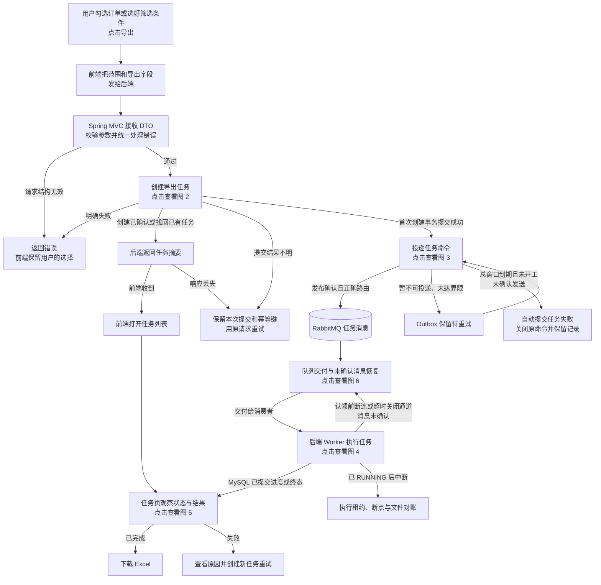
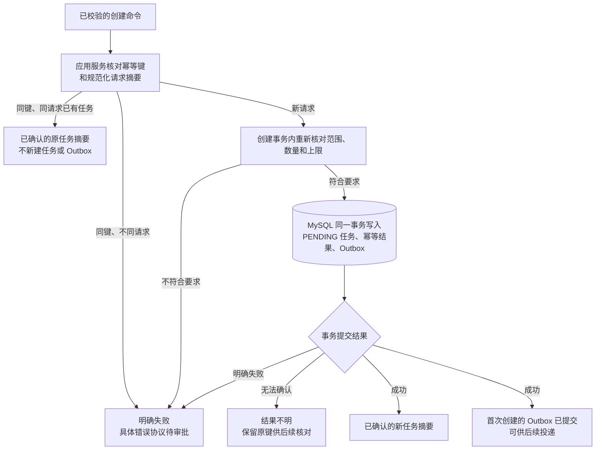
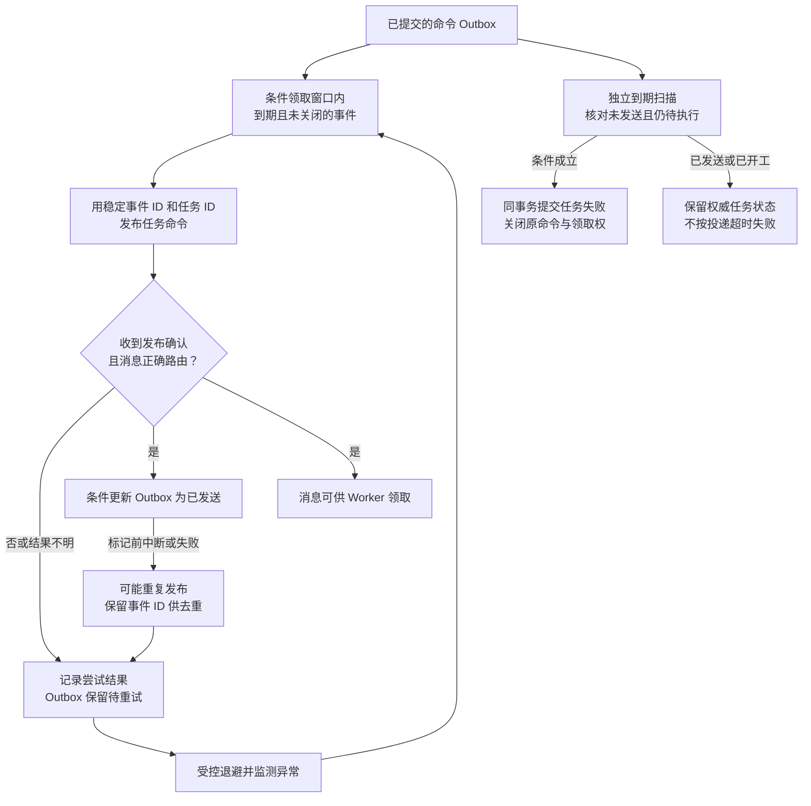
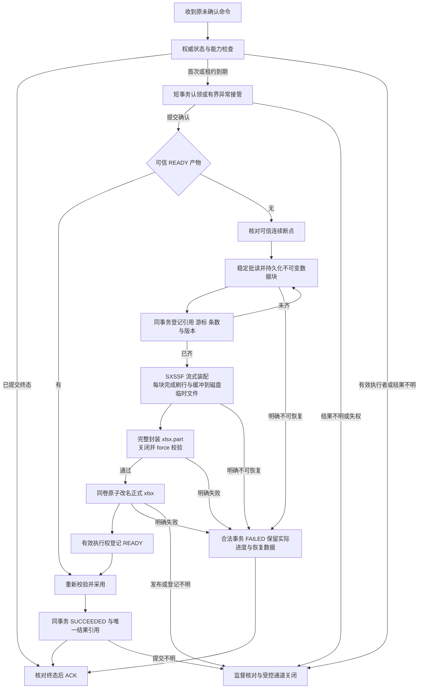
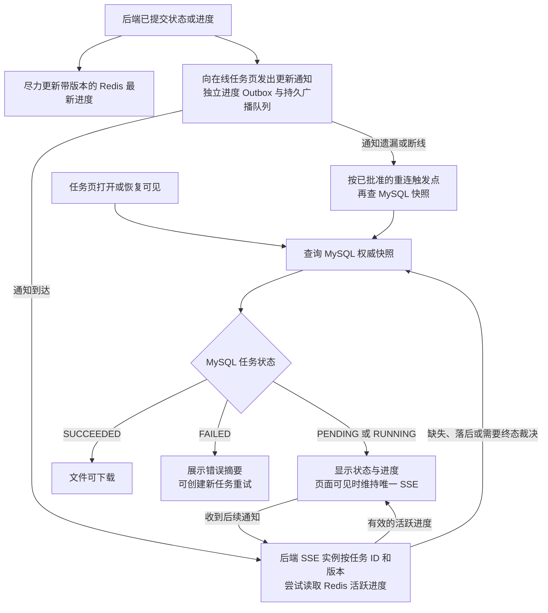
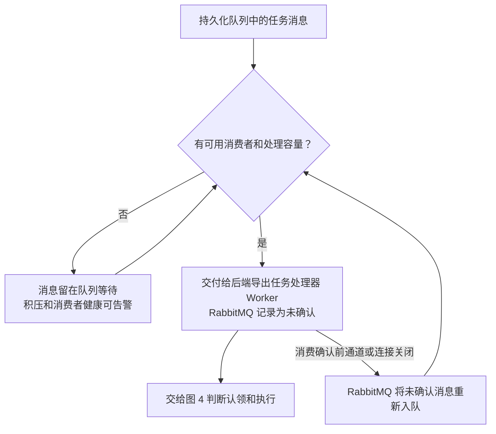

# 订单导出：从点击按钮到拿到文件

这是一份帮助理解后端工作顺序的学习稿，不是已经运行的系统说明，也不是获批的功能规格。项目目前只有规则和设计文档，还没有前后端实现。

## 本稿与正式文档的边界

| 内容 | 归属 | 本稿如何使用 |
| --- | --- | --- |
| 用户能否确认任务创建、查看进度、下载或重试 | [产品需求](docs/product/order-export-prd.md)与[验收基线](docs/product/acceptance-criteria.md) | 用白话解释行为，不在本稿另立验收定义。 |
| MySQL 事实源、任务与 Outbox 同事务、RabbitMQ 交付与确认、Redis 缓存职责 | 已接受的 [`ADR-0004`](docs/adr/0004-rabbitmq-task-queue.md)、[`ADR-0005`](docs/adr/0005-backend-stack-and-progress-cache.md)、[`ADR-0006`](docs/adr/0006-broker-owned-pending-delivery.md) | 图中的这些边界以 ADR 为准；本稿只展开先后关系。 |
| 状态字段、消息内容、接口与 SSE 事件、超时、并发和故障恢复细节 | 将来的功能规格、数据模型及契约 | 以下流程图和备忘只是候选设计，未获规格审批，不可直接当实现任务。 |

主图展示端到端环节；后续细节图按图号编号，在主图对应节点标注引用并提供点击跳转。

## 图 1：订单导出主流程

```mermaid
flowchart TD
  A[用户勾选订单或选好筛选条件<br/>点击导出] --> B[前端把范围和导出字段<br/>发给后端]
  B --> C[Spring MVC 接收 DTO<br/>校验参数并统一处理错误]
  C -->|请求结构无效| E[返回错误<br/>前端保留用户的选择]
  C -->|通过| CREATE[创建导出任务<br/>点击查看图 2]
  CREATE -->|明确失败| E
  CREATE -->|创建已确认或找回已有任务| R[后端返回任务摘要]
  CREATE -->|提交结果不明| U[保留本次提交和幂等键<br/>用原请求重试]
  CREATE -->|首次创建事务提交成功| DISPATCH[投递任务命令<br/>点击查看图 3]
  R -->|前端收到| VIEW[前端打开任务列表]
  R -->|响应丢失| U
  DISPATCH -->|发布确认且正确路由| Q[(RabbitMQ 任务消息)]
  DISPATCH -->|暂不可投递、未达界限| HOLD[Outbox 保留待重试]
  HOLD --> DISPATCH
  DISPATCH -->|总窗口到期且未开工<br/>未确认发送| ALERT[自动提交任务失败<br/>关闭原命令并保留记录]
  Q --> DELIVERY[队列交付与未确认消息恢复<br/>点击查看图 6]
  DELIVERY -->|交付给消费者| EXEC[后端 Worker 执行任务<br/>点击查看图 4]
  EXEC -->|认领前断连或超时关闭通道<br/>消息未确认| DELIVERY
  EXEC -->|MySQL 已提交进度或终态| OBSERVE[任务页观察状态与结果<br/>点击查看图 5]
  EXEC -->|已 RUNNING 后中断| RECOVER[执行租约、断点与文件对账]
  VIEW --> OBSERVE
  OBSERVE -->|已完成| DOWNLOAD[下载 Excel]
  OBSERVE -->|失败| RETRY[查看原因并创建新任务重试]
  click CREATE href "#figure-2" "查看图 2：创建导出任务细节流程"
  click DISPATCH href "#figure-3" "查看图 3：任务命令投递细节流程"
  click EXEC href "#figure-4" "查看图 4：Worker 执行细节流程"
  click OBSERVE href "#figure-5" "查看图 5：任务状态观察细节流程"
  click DELIVERY href "#figure-6" "查看图 6：队列交付与未确认消息恢复细节流程"
```

可以把它想成“提交申请”和“后台办事”两段。[图 2](#figure-2)展开了图 1 的“创建导出任务”节点。首次创建时，后端先确定任务 ID，并把任务记录提交到 MySQL；**只有事务提交成功，才能回复前端任务已创建**。从提交成功的那一刻起，后台投递与 HTTP 响应并行推进；前端真正收到响应时，消息可能尚未入队，也可能已入队甚至已开工。因此“创建任务成功”只说明任务已登记，不说明它当时位于队列的哪个位置。

| 阶段 | 可确认的依据 | 谁负责停滞处理 |
| --- | --- | --- |
| 创建事务刚提交 | MySQL 中有 `PENDING` 任务及待发送 Outbox；此时只保证登记成功 | Outbox dispatcher 随后领取待发送命令。 |
| 命令还没确认发送 | Outbox 未标记 `SENT` | dispatcher 在总窗口内受控重试；到期未开工则自动失败并关闭命令，见[图 3](#figure-3)与 [`ADR-0007`](docs/adr/0007-outbox-dispatch-retry.md)。 |
| 命令已确认发送，尚在队列等待或已交付但未认领 | Outbox 为 `SENT`，MySQL 任务仍为 `PENDING`；MySQL 不记录每条消息在 RabbitMQ 内的瞬时位置 | RabbitMQ 保管排队及未确认消息，断连后重交付，见[图 6](#figure-6)。连接存活却迟迟未认领时，由消费端监测告警并受控关闭通道，阈值和隔离方式待规格验证，见[图 4](#figure-4)。 |
| Worker 已认领 | MySQL 已提交 `RUNNING` | Worker 负责执行；中断按ADR-0008执行租约/断点/产物恢复，不再走待执行对账。 |
| 已完成或已失败 | MySQL 已提交终态 | 迟到消息由 Worker 核对终态后确认并丢弃，不生成文件。 |

这里“已交付给 Worker”不等于“Worker 已开工”。系统以 MySQL 的 `RUNNING` 提交作为唯一开工界线，避免用难以持久核对的队列交付状态来决定业务成败。

## 创建任务：从请求到确认

图 2 只展开图 1 的“创建导出任务”节点：输入是接口层已校验的创建命令，输出是已确认的任务摘要、明确失败、结果不明，或首次创建后可供投递的 Outbox。前端响应、RabbitMQ 投递和文件生成不在图 2 内。

| 参与方 | 创建节点内部的职责 |
| --- | --- |
| 后端应用服务 | 协调幂等检查、业务校验、任务 ID、范围快照和创建事务；只有确认已提交的任务才能作为创建结果返回。 |
| 领域规则 | 检查范围、字段、数量上限和幂等请求的一致性。 |
| MyBatis/MySQL | 执行计数及持久化，通过事务和唯一约束保证任务、幂等结果与待投递记录一致。 |

### 图 2：创建导出任务细节流程

```mermaid
flowchart TD
  A[已校验的创建命令] --> C[应用服务核对幂等键<br/>和规范化请求摘要]
  C -->|同键、同请求已有任务| R[已确认的原任务摘要<br/>不新建任务或 Outbox]
  C -->|同键、不同请求| E[明确失败<br/>具体错误协议待审批]
  C -->|新请求| V[创建事务内重新核对范围、数量和上限]
  V -->|不符合要求| E
  V -->|符合要求| D[(MySQL 同一事务写入<br/>PENDING 任务、幂等结果、Outbox)]
  D --> K{事务提交结果}
  K -->|明确失败| E
  K -->|无法确认| U[结果不明<br/>保留原键供后续核对]
  K -->|成功| S[已确认的新任务摘要]
  K -->|成功| O[首次创建的 Outbox 已提交<br/>可供后续投递]
```

同时到达的同键请求不能只靠“先查询、再插入”判断谁是第一次提交；MySQL 中幂等键的唯一约束负责裁决。未能创建的一方读取已提交的幂等结果并比较请求摘要：相同则返回同一任务，不同则拒绝。具体摘要规范化方式及冲突响应仍须评审，见[待确认决策](docs/decisions-pending.md)。

首次创建时，事务内需要保存三类相互关联的数据：

| 记录 | 必须保留的创建信息 |
| --- | --- |
| 导出任务 | 稳定任务 ID、`PENDING` 状态、命中总数、有序字段、创建时间及导出范围。`SELECTED` 固定已选订单 ID；`FILTERED` 固定已提交的筛选条件，不包含分页参数。 |
| 幂等结果 | `Idempotency-Key`、规范化请求摘要和关联任务 ID；同一次提交的重试据此找回同一任务。 |
| 命令 Outbox | 稳定事件 ID、关联任务 ID 和待投递状态；记录任务提交后仍需通知执行方，不要求 RabbitMQ 在创建事务中可用。 |

服务端根据本次范围重新计算命中数量并校验上限，不能采用前端显示的数量。以上记录一起提交或一起回滚；生成了 ID、执行了写入语句，都还不等于创建成功。

### 创建结果交给前端后

以下是图 1 的响应环节，不属于图 2 的创建节点。前端在发起请求前固定本次提交的范围、有序字段和 `Idempotency-Key`，并按最终结果处理：

| 结果 | 前端行为 |
| --- | --- |
| 首次创建已确认，或同键同请求找回已创建任务 | 使用返回的任务 ID 和完整摘要，清空已选订单并进入任务列表；已有任务可能已从 `PENDING` 进入后续状态。 |
| 已确认的校验错误、事务回滚或同键不同请求 | 不展示创建成功；留在订单页，保留筛选条件、导出字段和已选订单，显示对应错误。 |
| 请求超时、连接中断或提交结果不明 | 暂不宣称成功或失败，保留上述输入和原 `Idempotency-Key`；同一次提交重试原请求，由后端返回已有任务或完成首次创建。 |

## 任务创建后：投递、执行与观察

前端收到创建成功时，后台可能已经开始投递或执行；HTTP 响应与后台流程都以创建事务提交为前提，不互相等待。[图 3](#figure-3)、[图 4](#figure-4)、[图 5](#figure-5)和[图 6](#figure-6)分别只展开图 1 中同名节点。RabbitMQ 任务队列和 Redis 最新进度缓存的选型已确定；运行参数已按本次决策定稿；完整任务页/SSE明确延期，当前业务流程尚未实施。

### 图 3：投递任务命令细节流程

图 3 替换图 1 的“投递任务命令”节点。输入是已提交的命令 Outbox；输出是 RabbitMQ 中可供 Worker 领取的任务消息、窗口内待重试的记录，或到期未开工的失败任务及已关闭命令。超时扫描独立于投递循环，参数与竞态裁决见 [`ADR-0007`](docs/adr/0007-outbox-dispatch-retry.md)。前端响应和任务消费均不在此图内。

```mermaid
flowchart TD
  A[已提交的命令 Outbox] --> B[条件领取窗口内<br/>到期且未关闭的事件]
  B --> C[用稳定事件 ID 和任务 ID<br/>发布任务命令]
  C --> D{收到发布确认<br/>且消息正确路由？}
  D -->|否或结果不明| H[记录尝试结果<br/>Outbox 保留待重试]
  H --> W[受控退避并监测异常]
  W --> B
  A --> T[独立到期扫描<br/>核对未发送且仍待执行]
  T -->|条件成立| F[同事务提交任务失败<br/>关闭原命令与领取权]
  T -->|已发送或已开工| KEEP[保留权威任务状态<br/>不按投递超时失败]
  D -->|是| M[条件更新 Outbox 为已发送]
  D -->|是| Q[消息可供 Worker 领取]
  M -->|标记前中断或失败| DUP[可能重复发布<br/>保留事件 ID 供去重]
  DUP --> H
```

发布确认属于生产者与 RabbitMQ 之间的阶段，不表示 Worker 已消费或任务已完成。补投与自动终止由 [`ADR-0007`](docs/adr/0007-outbox-dispatch-retry.md) 规定：总窗口到期时，未确认发送且未开工的任务自动失败，原 Outbox 关闭并保留；判定与 Worker 认领、发布成功标记在 MySQL 中串行裁决。已失败任务的迟到消息只核对终态后确认，不生成文件。若 broker 已确认但投递程序尚未标记 Outbox 就中断，重试可能造成重复消息，后续 Worker 必须靠 MySQL 条件状态更新保持幂等。队列保留、崩溃退避和单条故障隔离也按该 ADR 执行。Outbox 标为已发送后的交付与未确认消息恢复由[图 6](#figure-6)展开，见 [`ADR-0006`](docs/adr/0006-broker-owned-pending-delivery.md)。

### 图 4：Worker 执行任务细节流程

图4展开当前订单规格的真实执行链。原命令保持未确认，MySQL裁决执行权；数据先保存为可恢复块，Excel已完成行逐批刷到临时文件，完整结果校验后原子改名。详细文件/函数/参数见[本期Excel方案](specs/002-order-management/excel-design.md)，架构子集已接受，规格仍待独立审批。

```mermaid
flowchart TD
  A[收到原未确认命令] --> B[权威状态与能力检查]
  B -->|已提交终态| ACK[核对终态后 ACK]
  B -->|首次或租约到期| C[短事务认领或有界异常接管]
  B -->|有效执行者或结果不明| HOLD[监督核对与受控通道关闭]
  C -->|提交确认| R{可信 READY 产物}
  R -->|有| CHECK[重新校验并采用]
  R -->|无| CP[核对可信连续断点]
  CP --> G[稳定批读并持久化不可变数据块]
  G --> P[同事务登记引用 游标 条数与版本]
  P -->|未齐| G
  P -->|已齐| TMP[SXSSF 流式装配<br/>每块完成刷行与缓冲到磁盘临时文件]
  TMP --> PART[完整封装 xlsx.part<br/>关闭并 force 校验]
  PART -->|通过| PUB[同卷原子改名正式 xlsx]
  PUB --> READY[有效执行权登记 READY]
  READY --> CHECK
  CHECK --> S[同事务 SUCCEEDED 与唯一结果引用]
  S --> ACK
  G -->|明确不可恢复| F[合法事务 FAILED 保留实际进度与恢复数据]
  TMP -->|明确不可恢复| F
  PART -->|明确失败| F
  PUB -->|明确失败| F
  F --> ACK
  C -->|结果不明或失权| HOLD
  S -->|提交不明| HOLD
  PUB -->|发布或登记不明| HOLD
```

首次PENDING提交RUNNING才开工；异常中断只能按过期租约与预算取得新owner/fence后继续。源批与Excel窗口有界，生成期间不持DB行锁。每批Excel行刷入磁盘临时sheet，最终只写一次完整.xlsx.part；关闭/校验/原子改名和成功引用提交后才可下载。改名失败不成功，未完成临时内容不当作正式结果。

认领5秒与执行lease30秒、心跳5秒、单次5分钟及broker ACK timeout10分钟分别监测；DB不可读、失权和提交不明先停止新工作并核对。临时sheet不是跨进程断点，崩溃用可信不可变数据块恢复；READY优先对账，成功提交不明保留引用。坏消息停消费槽保留原消息，不能ACK或自动死信。

### 图 5：任务状态与结果观察细节流程

图 5 替换图 1 的“任务页观察状态与结果”节点。输入是用户打开的任务页，以及 MySQL 已提交的任务状态或进度；输出是继续等待、可下载或可查看原因并重试。它描述任务页如何观察结果，不负责推进任务状态。

```mermaid
flowchart TD
  A[任务页打开或恢复可见] --> SNAP[查询 MySQL 权威快照]
  B[后端已提交状态或进度] --> CACHE[尽力更新带版本的 Redis 最新进度]
  B --> NOTICE[向在线任务页发出更新通知<br/>独立进度 Outbox 与持久广播队列]
  NOTICE -->|通知到达| READ[后端 SSE 实例按任务 ID 和版本<br/>尝试读取 Redis 活跃进度]
  READ -->|有效的活跃进度| ACTIVE[显示状态与进度<br/>页面可见时维持唯一 SSE]
  READ -->|缺失、落后或需要终态裁决| SNAP
  NOTICE -->|通知遗漏或断线| REC[按已批准的重连触发点<br/>再查 MySQL 快照]
  REC --> SNAP
  SNAP --> STATE{MySQL 任务状态}
  STATE -->|PENDING 或 RUNNING| ACTIVE
  ACTIVE -->|收到后续通知| READ
  STATE -->|SUCCEEDED| DONE[文件可下载]
  STATE -->|FAILED| FAIL[展示错误摘要<br/>可创建新任务重试]
```

Redis 只缓存任务的最新进度，不是任务状态的事实源，也不是可回放的通知日志；在线活跃任务有进度通知时，SSE 实例优先读缓存以加速更新，缓存失败、缺失或版本落后时从 MySQL 回源。首次进入和异常断线后用 MySQL 快照回补，终态、下载资格及空闲关闭也由 MySQL 裁决。后续可靠通知采用独立进度Outbox、durable fanout及每稳定实例持久队列，重连先MySQL快照，具体方向和连接/缓存参数见[ADR-0009](docs/adr/0009-engineering-runtime-and-progress-notification.md)。图5描述后续完整任务页，当前订单规格只提供单任务手动快照及下载；缓存更新本身不等于广播已送达。

### 图 6：队列交付与未确认消息恢复细节流程

图 6 完整替换图 1 的“队列交付与未确认消息恢复”节点。输入是图 3 发布确认且正确路由后的任务消息，或图 4 关闭通道后重新入队的未确认消息；输出是交付给后端导出任务处理器（Worker）的未确认消息，或继续排队等待的消息。MySQL 认领及其超时监测只在图 4 内；本图不接收前端请求，不创建恢复 Outbox，也不决定任务执行结果。

```mermaid
flowchart TD
  A[持久化队列中的任务消息] --> B{有可用消费者和处理容量？}
  B -->|否| WAIT[消息留在队列等待<br/>积压和消费者健康可告警]
  WAIT --> B
  B -->|是| D[交付给后端导出任务处理器 Worker<br/>RabbitMQ 记录为未确认]
  D --> OUT[交给图 4 判断认领和执行]
  D -->|消费确认前通道或连接关闭| REQUEUE[RabbitMQ 将未确认消息重新入队]
  REQUEUE --> B
```

RabbitMQ 能区分“仍在队列”和“已交付但尚未确认”，却不知道 MySQL 是否已提交 `RUNNING`。图 4 负责识别认领前卡住并关闭对应消费通道；图 6 只表示 RabbitMQ 随后重交付未确认消息。当前规则要求长时间文件生成完成后才确认消费，不能仅靠 RabbitMQ 的消费确认超时判断认领是否卡住。阈值、通道隔离、监测器自身故障及执行中长任务的确认超时，仍须在规格中验证。`PENDING` 排队过久只告警，不自动补投或判任务失败。规则见 [`ADR-0006`](docs/adr/0006-broker-owned-pending-delivery.md)。

### Worker 执行恢复的架构提案

[ADR-0008](docs/adr/0008-worker-execution-lease-and-recovery.md)已接受当前MVP所需执行租约、异常有界接管、不可变块断点及产物对账子集。用户暂停/显式恢复、跨主机存储明确延期，不增加暂停状态或新的恢复Outbox。技术参数和工程工具见[决策记录](specs/002-order-management/decision-record.md)，决定已定而运行证据未产生。

恢复先核对结果与连续块；无可信断点仅在只读源/固定配置/尝试隔离及唯一结果引用证明安全后建立新数据代次。显示高水位不当作恢复游标，无法证明安全或预算耗尽由合法事务提交失败并确认原消息。实际kill、旧身份、文件改名与终态竞态还须验证。

### 已确定处理与尚未执行的验证

命令投递到期按[ADR-0007](docs/adr/0007-outbox-dispatch-retry.md)处理，已发送交付按[ADR-0006](docs/adr/0006-broker-owned-pending-delivery.md)处理；执行/文件恢复见[ADR-0008](docs/adr/0008-worker-execution-lease-and-recovery.md)，坏消息及后续通知见[ADR-0009](docs/adr/0009-engineering-runtime-and-progress-notification.md)。方向已确定，运行/故障验证仍未执行，学习稿不能替代正式规格与测试门禁。

## 按时间顺序看后端做了什么

假设用户要导出 1,000 条订单，并选择了“订单号、金额、下单时间”三列。

1. **接收申请。**前端发送导出范围和列名。范围可以是勾选的订单 ID，也可以是当前筛选条件命中的**所有**订单，不只是屏幕上的这一页。后端先把请求内容接收为一个 DTO。DTO 可以简单理解为“装着前端所填数据的临时表单”，不是数据库中的任务记录。
2. **检查申请。**后端确认范围和字段是否合法、实际会导出多少条，且没有超过 200,000 条。它还会识别同一次提交的网络重试，避免用户因超时再点一次就产生两个文件。前端做过检查，后端仍要自己再检查。
3. **确定任务 ID 并登记任务。**这里的“任务索引”指前端日后用来定位任务的稳定任务 ID，不是 MySQL 的数据库索引。首次创建时，在同一个 MySQL 事务中写入任务、幂等结果和待投递 Outbox；并发同键请求由唯一约束裁决。完整内容见[图 2](#figure-2)。
4. **确认创建结果，再回复用户。**只有事务提交成功，或核对到同键同请求已经提交的任务，后端才能返回任务摘要。首次提交时任务为 `PENDING`；找回已有任务时返回该任务的当前摘要，状态可能已经变化。提交结果不明或响应丢失时，同一次提交复用原 `Idempotency-Key` 重试。前端只在确认成功后清空选择并进入任务列表。
5. **送进消息队列。**事务提交后，投递程序才能读取已提交的待发送记录并发给 RabbitMQ。它和 HTTP 响应都以提交成功为前提，彼此没有必须先完成的顺序。RabbitMQ 发布确认且正确路由后，消息就可能被 Worker 领取；投递程序另行标记 Outbox 已发送。暂时发送失败就在窗口内保留记录并重试；未发送、未开工而到期时自动失败并关闭原命令，详见[图 3](#figure-3)和 [`ADR-0007`](docs/adr/0007-outbox-dispatch-retry.md)。
6. **排队、交付与恢复。**命令确认发送后，由 RabbitMQ 排队并交给后端导出任务处理器（Worker）。消息交付但未确认时，Worker 断连会使 RabbitMQ 重交付。任务排队久只告警，不按时长补投或判失败。详见[图 6](#figure-6)。
7. **后台执行。**RabbitMQ 消息的消费者是后端的导出任务处理器（Worker）；RabbitMQ 负责传递消息，前端不消费任务消息。Worker 领到消息后，先到 MySQL 有条件地将任务改为 `RUNNING`，避免两个处理器重复生成；连接存活但认领前卡住时，由消费端监测并受控关闭对应通道。它按创建时保存的范围，从 MySQL 按稳定顺序一批批读取订单，再用 SXSSF 逐批写临时 Excel。文件校验和发布后才能提交成功终态；只有终态已提交或权威状态证明无需处理后，才确认消费。详见[图 4](#figure-4)。
8. **报告进度和结果。**Worker 先把处理数或终态写入 MySQL，再尽力更新 Redis 最新进度缓存；缓存失败不影响已经提交的任务状态。任务页初次进入或断线后读取 MySQL 快照；在线进度通知到达时，后端 SSE 实例优先读取版本有效的 Redis 缓存，缓存缺失或过期时回源 MySQL。终态及空闲仍由 MySQL 裁决。跨实例通知采用独立进度Outbox和每实例持久广播队列；当前订单规格不接入Redis/SSE，设计确认不能视为已经实施。详见[图 5](#figure-5)。
9. **下载、重试与恢复。**已完成任务可下载；失败后以原配置新建任务，旧记录保留。Worker 意外退出时，租约和任务状态帮助后续程序判断是否接手；残留临时文件定期清理，具体恢复规则和参数已定稿，实际验证与两次开发门禁仍未完成。

## MySQL、RabbitMQ、Redis 和文件各管什么

| 位置 | 用白话说 | 保存什么 |
| --- | --- | --- |
| MySQL | 正式账本 | 订单、任务要求、任务状态、进度、错误和文件信息 |
| RabbitMQ | 任务消息队列 | 向后端导出任务处理器（Worker）传递任务消息，等待领取和确认 |
| Redis | 进度缓存 | 临时保存最新进度，方便读取；丢失后从 MySQL 恢复 |
| 文件存储 | 放成品的地方 | 真正生成的 Excel 文件 |

所以，**任务和进度都以 MySQL 为准**。RabbitMQ 排导出任务，Redis 只缓存最新进度，不负责排队，也不保存唯一的任务事实。普通订单和任务列表没有默认加缓存。

## 两个容易混淆的问题

**为什么不在收到请求后直接生成 Excel？** 大任务可能需要较长时间。让用户一直等 HTTP 请求，容易超时，也无法方便地查看进度。先登记、后处理，页面可以立即获得任务编号。

**为什么 MySQL 里还要记“需要排队”，不直接发 RabbitMQ？** 如果刚保存任务，程序就崩溃，直接发送可能来不及完成。先在同一次数据库操作中记下待办，再由投递程序发送，即使 RabbitMQ 暂时故障，也知道之后还需要补发。消息可能重复送达，所以后台处理前还要核对 MySQL，不能看到同一消息就重复生成文件。

## 当前确定了什么，什么还没定

按截图调整后的方向是：前端 React + TypeScript，后端 Java 21 + Spring Boot 3 的 Spring MVC API，MyBatis 负责数据库访问，Flyway 管数据库结构升级，MySQL 8.4 保存正式数据，RabbitMQ 负责导出任务队列，Redis 缓存最新进度，SSE 广播到前端，Apache POI SXSSF 生成 Excel。

命令尚未确认发送时的补投与自动失败出口由 [`ADR-0007`](docs/adr/0007-outbox-dispatch-retry.md) 决定；确认发送后的队列交付职责由 [`ADR-0006`](docs/adr/0006-broker-owned-pending-delivery.md) 决定。执行锁须具备 owner、有效期和心跳续租，续写须具备分批持久化及进度版本，重跑须证明重复执行安全；已接受子集见 [`ADR-0008`](docs/adr/0008-worker-execution-lease-and-recovery.md)。当前MVP所需执行恢复子集、超时/心跳/预取/通道/文件清理参数已确认；后续SSE广播/缓存/断线参数见[ADR-0009](docs/adr/0009-engineering-runtime-and-progress-notification.md)，暂停与跨主机存储延期。学习稿不是项目规则或获批规格。

参考：[项目协作基线](AGENTS.md)、[后端规则](docs/rules/backend.md)、[RabbitMQ 队列决策](docs/adr/0004-rabbitmq-task-queue.md)与[后端栈及进度缓存决策](docs/adr/0005-backend-stack-and-progress-cache.md)。具体运行与恢复参数见[决策记录](specs/002-order-management/decision-record.md)，运行证据未产生。

## 待评审细节备忘

以下是从工程规则中移出的本次导出功能细节，供学习和后续讨论使用。它们不构成项目规则、正式契约或已获批的功能规格；与产品基线、ADR 冲突时，以正式文档为准。

### 前端页面与接口草案

- 计划只有订单管理 `/orders` 与导出任务 `/export-tasks` 两个业务页面，`/` 进入订单管理。已提交的筛选与分页放在 URL query，编辑中的表单、跨页勾选与未提交导出配置留在页面内存。切换页码不清空勾选；提交新筛选或重置时清空。
- 订单页区分“导出已选订单 ID”和“导出当前筛选结果”。后者取完整的已提交筛选快照，不带当前分页。导出字段使用稳定字段 ID 和有序列表，至少保留一个字段；后端仍要独立校验范围、字段和最大行数。
- 暂拟 `GET /api/v1/orders` 查询订单，`POST /api/v1/export-tasks` 创建任务，`GET /api/v1/export-tasks` 查询任务，`GET /api/v1/export-tasks/{taskId}/file` 下载，`POST /api/v1/export-tasks/{taskId}/retries` 从失败任务创建新任务。请求、响应和错误结构须待正式契约确认。
- 创建请求超时、连接中断或提交结果不明时，保留本次范围、字段、幂等键和页面选择；只用原请求及原键安全重试，不据网络错误断言任务已创建或未创建。收到首次创建或同键找回的任务摘要后，才清空选择并进入任务列表。
- 任务页以 MySQL 快照为权威，SSE 只承载在线更新通知；初次进入、恢复可见、恢复联网和手动刷新可触发一次快照，不启用固定轮询。SSE空闲关闭、重连及跨实例通知方向已见ADR-0009，完整事件结构在后续任务页规格展开。只有成功任务可下载；失败任务重试会创建新任务，原记录保留。

### 后端处理草案

- 任务内部状态暂按 `PENDING`（等待中）、`RUNNING`（生成中）、`SUCCEEDED`（已完成）、`FAILED`（失败）讨论。通常从等待进入生成，再进入成功或失败；未能确认投递且未开工的等待中任务允许按 [`ADR-0007`](docs/adr/0007-outbox-dispatch-retry.md) 到期失败，状态机与转换条件应进入未来 `data-model.md`。
- 创建时保存范围快照、命中数量、有序字段和幂等结果；同键同请求找回已提交任务，同键不同请求拒绝。任务与待发送 Outbox 同事务提交后才返回创建成功，HTTP 响应和后台投递都以该提交为前提。
- Outbox dispatcher 发布后等待 RabbitMQ 的生产者发布确认与正确路由结果，再标记已发送；确认到达但标记前崩溃可能重复发布。补投在总窗口内进行，到期未确认发送且未开工时自动失败、关闭原命令并保留记录，见 [`ADR-0007`](docs/adr/0007-outbox-dispatch-retry.md)。
- 命令消息字段暂拟稳定事件 ID、任务 ID、类型、版本及必要追踪信息，不携带客户资料、完整筛选、幂等键或文件路径；字段名、必填性与兼容规则应进入未来 `contracts/`。MyBatis 的筛选、Keyset 分页、条件状态更新和 Outbox 领取 SQL 应进入 `plan.md` 与 `data-model.md`，不能从示意图直接生成表结构或 SQL。
- 消费者是后端导出任务处理器（Worker）。消息交付不等于 MySQL 已认领；Worker 先有条件地推进任务状态，再生成文件。RabbitMQ 的生产者发布确认与消费者手动确认分属不同阶段。预取1/并发1、认领5秒、执行lease30秒/心跳5秒、ACK timeout10分钟已经定稿；无自动死信或重交付删除上限，实际行为仍须测试。
- 读取订单时按创建时范围和稳定顺序分批处理；SXSSF 写任务专属临时文件，关闭、校验并安全发布后才能提交成功终态。查询、写入、关闭、移动、终态提交和清理之间的故障窗口需要单独设计，不能仅靠重复生成文件恢复。
- Worker 先提交 MySQL 进度或终态，再尽力更新 Redis 最新进度缓存。缓存不是事件历史，也不保证所有 SSE 实例已收到通知；缓存缺失或断线时从 MySQL 回补。正式文件和任务记录按产品保留要求处理，仅清理可证明无效的临时文件。

### 接口与实时通知契约草案

- 创建请求的 `Idempotency-Key`、规范化载荷摘要、同键冲突响应和创建结果不明时的重试方式，须在未来 `contracts/` 中写清。API 时间暂按带 `Z` 的 UTC ISO 8601 讨论；页面和文件的人类时间按产品时区展示。
- 实时通道采用 SSE 的架构方向已确定，但 `stream-idle` 事件名、`EventSource` 正常关闭、活动版本并发复核、跨标签页唤醒、异常断线退避和快照回补的完整时序仍是功能契约草案。事件ID采用版本语义，跨实例机制采用独立进度Outbox；协议字段留后续规格，不能把本稿的箭头当成代码实施授权。
- 将来规格应把创建事务、Outbox 投递、消息重复或断连、Worker 文件发布、Redis 缓存故障和 SSE 回补分别映射到可验证用例。测试工具及本地构建/打包门禁已在[ADR-0009](docs/adr/0009-engineering-runtime-and-progress-notification.md)与[构建规则](docs/rules/build.md)定稿，托管CI/远程发布延期。

### 将来需要验证的故障窗口

- 创建事务回滚、提交结果不明、同键并发、RabbitMQ 暂不可用、发布确认后 Outbox 尚未标记、重复或迟到消息。
- Worker 收到消息但认领前断连、连接存活却卡住、认领后生成中断、终态提交后消费确认前断连，以及两个 Worker 争取同一任务。
- 文件关闭或发布失败、文件已发布但终态未提交、MySQL/Redis 不可用、SSE 漏通知或断线后回补。
- 文件内容、字段顺序、行数、金额和时区准确性；性能与资源目标应在固定环境中独立测量。
