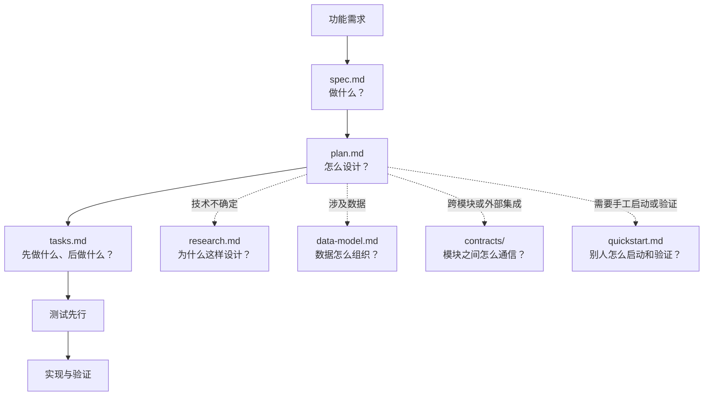

# Export Flow

项目规范、文档基线和协作入口都在 [`AGENTS.md`](AGENTS.md)。模型或贡献者开始工作前，请先阅读该文件。

本仓库采用规格驱动开发方法和中文规格模板。项目原则位于 `.specify/memory/constitution.md`。当前技术决策见 [`docs/adr/`](docs/adr/)，新出现且尚未决定的事项记录在 [`docs/decisions-pending.md`](docs/decisions-pending.md)。

已确认技术栈：React + TypeScript + Vite + Ant Design 前端，Java 21 + Spring Boot 3 + MySQL 8.4 后端，Apache POI 流式生成 Excel；本地通过 Docker Compose 运行。RabbitMQ 导出任务队列、MyBatis、Flyway 与 Redis 进度缓存是待评审的目标方案，详见 [`docs/rules/backend.md`](docs/rules/backend.md)；旧 Redis Streams 决策在替代 ADR 获批前仍须按状态辨别，不得将两套方案混用。

规格流程仅负责开发阶段的需求、计划和任务拆分；构建、测试执行、打包、容器和发布遵循 `docs/rules/` 中的项目规则。中高风险变更使用 `spec.md`、`plan.md`、`tasks.md` 及按需生成的附属产物。

## 使用方式

### 只查看代码或运行已有产物

直接阅读 [`AGENTS.md`](AGENTS.md) 和项目对应的运行说明即可。

### 参与开发

阅读 [`AGENTS.md`](AGENTS.md)，根据任务查阅对应的项目规则。中高风险功能使用
按“需求规格 → 澄清（可选）→ 技术计划 → 任务拆分”阶段完成文档，获得项目负责人明确批准后，再按照项目测试、构建
和发布规则完成实现。

## 项目结构

```text
.
├── AGENTS.md                         # 模型入口、最高级项目规则和文档索引
├── README.md                         # 人类贡献者入口和快速开始说明
├── .specify/                         # 规格模板和开发原则
│   ├── memory/constitution.md        # 开发阶段规则和门禁
│   └── templates/                    # spec/plan/tasks 等标准模板
├── specs/                            # 按需创建的功能规格和任务
├── docs/
│   ├── rules/                        # 前后端、测试、构建、容器等领域细则
│   ├── adr/                          # 架构决策记录
├── scripts/                          # 项目级检查和自动化脚本
├── src/                              # 生产代码（项目初始化后补充具体结构）
└── tests/                            # 自动化测试和测试夹具
```

## 规则权级和文件权限

规则从高到低为：

```text
AGENTS.md
  > .specify/memory/constitution.md
  > docs/rules/
  > specs/<feature-dir>/
  > 实现代码
```

| 内容 | 权限和要求 |
| --- | --- |
| `AGENTS.md` | 项目最高管理规则，修改需要项目负责人评审 |
| `.specify/memory/constitution.md` | 开发流程和门禁，必须遵守 AGENTS.md，修改需要治理评审 |
| `.specify/` 模板和原则 | 项目开发基础设施，不能在普通功能开发中随意修改 |
| `docs/rules/` | 各领域执行细则，由对应领域负责人评审 |
| `specs/` | 按需创建的功能规格、计划和任务，随功能变更提交并评审 |
| `docs/adr/` | 架构决策记录，重大技术选择必须新增或更新 |

任何下级文档与上级规则冲突时，必须暂停当前工作，先按上级规则修正文档。

## 按任务查阅

- 只查看或运行项目：阅读本 README 和 `AGENTS.md`。
- 前端开发：`AGENTS.md` → constitution → `docs/rules/frontend.md` → `docs/rules/testing.md`。
- 后端开发：`AGENTS.md` → constitution → `docs/rules/backend.md` → `docs/rules/testing.md`。
- 中高风险功能：再创建并评审 `specs/<feature-dir>/spec.md`、`plan.md` 和 `tasks.md`。
- 架构、依赖或数据存储变化：增加或更新 `docs/adr/`。
- 构建、打包、容器和发布：读取对应的 `docs/rules/`，这些环节不由规格流程接管。

## 规格产物说明

每个中高风险功能至少包含三个核心文件：

| 文件 | 作用 |
| --- | --- |
| `spec.md` | 说明用户要解决什么问题、功能范围、用户故事和验收标准 |
| `plan.md` | 说明准备采用什么技术方案、如何组织代码和如何落地 |
| `tasks.md` | 将计划拆成有顺序、可执行、可追踪的开发任务 |

`plan` 阶段会根据功能需要生成附属文件，不是每次都全部生成：

| 产物 | 用途 | 什么时候需要 |
| --- | --- | --- |
| `research.md` | 记录技术调研、方案比较、实验结果和选择理由 | 技术方案不确定，或存在多个候选方案时 |
| `data-model.md` | 记录实体、字段、类型、关系、约束、状态和生命周期 | 涉及数据库、持久化数据或复杂状态时 |
| `contracts/` | 记录 API、事件、消息和模块边界的输入输出格式 | 跨模块、跨服务或对接外部系统时 |
| `quickstart.md` | 记录本功能的本地启动、配置、操作和验证方法 | 需要手工验证、演示或新增运行步骤时 |

判断方式很简单：如果功能没有对应内容，就不需要创建该文件；如果功能涉及对应内容，
就必须生成并填写。所有生成的规格内容必须使用中文，并且最终要能映射到测试和任务。

规格产物流程：



`spec.md`、`plan.md` 和 `tasks.md` 是核心链路；其他文件根据功能实际需要从 `plan.md`
分支生成。没有对应场景时不创建附属文件。
