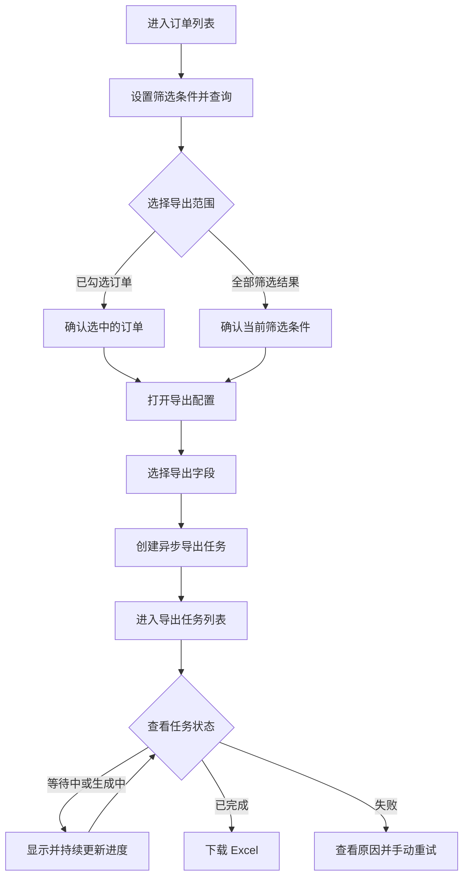

# 产品需求文档：订单异步导出

**创建日期**：2026-09-13

**版本**：1.0.2

**定稿日期**：2026-09-13

**修订日期**：2026-09-18

**修订说明**：确认查询和排序语义、任务状态筛选与分页、精确到秒的时间范围、创建后跳转及轻量 404。

**文档目的**：定义订单查询和 Excel 异步导出的产品需求，作为后续产品评审及前端、后端、测试方案编写的共同依据。

**文档归属**：产品需求基线，不属于开发阶段功能规格。

## 1. 背景

订单运营人员经常需要根据下单时间、订单状态和销售渠道等条件筛选订单，并将结果导出为 Excel，用于对账、运营分析或离线处理。

当数据量增大时，在订单列表请求中一次查询全部数据、在内存中构造文件并通过同一个 HTTP 请求返回，容易出现请求超时、服务内存上涨、重复点击生成重复文件以及失败过程不可见等问题。

ExportFlow 需要提供独立、可复用的异步导出闭环。用户在订单列表提交导出后，可在导出任务列表查看任务进度和结果；任务成功后下载 Excel，失败后查看原因并重试。导出任务记录和生成的文件永久保留。

## 2. 产品目标

- 为订单运营人员提供订单筛选、勾选和分页浏览能力。
- 支持导出已选订单或符合当前筛选条件的全部订单。
- 支持单次最多 200,000 条订单数据的 Excel 导出，并在本地环境中于 120 秒内完成上限数据量的文件生成。
- 将耗时导出与订单列表请求解耦，使用户能够持续查看任务状态和处理进度。
- 使用幂等标识防止重复提交产生重复任务和重复文件。
- 让导出失败和不可执行操作对用户可见且可理解。

## 3. 目标用户与使用场景

### 3.1 目标用户

订单运营人员，包括需要进行对账、运营分析或离线处理的业务用户。

### 3.2 核心场景

1. 用户按条件查询订单并分页查看结果。
2. 用户跨一个或多个页面勾选订单，并导出所选订单。
3. 用户将符合当前筛选条件的全部订单导出，不受列表当前页限制。
4. 用户在导出任务列表查看任务状态和进度。
5. 用户下载已完成的 Excel 文件。
6. 用户查看失败原因并手动重试。

## 4. 端到端流程



## 5. 用户故事与验收场景

### 5.1 用户故事一：查询和浏览订单（P1）

作为订单运营人员，我希望按业务条件筛选订单并分页查看结果，以便定位需要分析或导出的订单。

**验收场景**：

1. **AC-001**：给定用户进入订单管理页面，当页面加载完成时，那么页面展示筛选区、操作区、订单表格和分页区，并立即按无筛选条件查询第一页，分页默认每页 20 条。
2. **AC-002**：给定用户填写一个或多个筛选条件，当点击“查询”时，那么系统按照全部已填写条件的“并且”关系查询，并从第一页展示结果。
3. **AC-003**：给定用户已经设置筛选条件或勾选订单，当点击“重置”时，那么系统清空筛选条件和已选订单，恢复第一页及每页 20 条，并立即按无筛选条件查询第一页。
4. **AC-004**：给定查询结果超过一页，当用户切换页码或将每页数量设置为 20、50、100 时，那么系统展示对应页面的数据、当前页、每页数量和总条数；修改每页数量后返回第一页。
5. **AC-005**：给定开始时间晚于结束时间，或最小金额大于最大金额，当用户发起查询时，那么系统阻止查询并给出可理解的校验提示。
6. **AC-020**：给定用户已经勾选订单，当切换分页时，那么系统保留已勾选订单；当用户修改筛选条件并重新查询时，那么系统清空此前勾选并展示新查询结果。
7. **AC-021**：给定用户输入订单号，当执行查询时，那么系统仅返回订单号完全相等的订单。
8. **AC-022**：给定用户按 `Asia/Hong_Kong` 选择精确到秒的下单时间范围，当执行查询时，那么系统将开始和结束时间转换为 UTC，并包含恰好等于两个边界的订单。
9. **AC-023**：给定用户输入最小金额和/或最大金额，当执行查询时，那么系统包含金额恰好等于已填写边界的订单。
10. **AC-024**：给定多条订单具有不同下单时间或相同下单时间，当展示查询结果时，那么系统按下单时间倒序、再按订单唯一 ID 倒序稳定排列。

### 5.2 用户故事二：创建订单导出任务（P1）

作为订单运营人员，我希望导出已选订单或全部筛选结果，以便将所需订单用于对账、分析或离线处理。

**验收场景**：

1. **AC-006**：给定用户至少勾选一笔订单，当点击“导出已选”、选择导出字段并确认时，那么系统基于已选订单和所选字段创建一个异步导出任务。
2. **AC-007**：给定用户没有勾选任何订单，那么“导出已选”不可用，并显示不可用原因。
3. **AC-008**：给定当前筛选结果不为空，当点击“导出筛选结果”、选择导出字段并确认时，那么系统基于符合当前筛选条件的全部订单和所选字段创建异步导出任务，导出范围不受当前页限制。
4. **AC-009**：给定当前筛选结果为空，那么“导出筛选结果”不可用，并显示不可用原因。
5. **AC-010**：给定系统收到多个携带同一 `Idempotency-Key` 的创建导出任务请求，那么这些请求只对应一个导出任务，不产生重复文件。
6. **AC-011**：给定导出范围包含十万条以上且不超过 200,000 条订单，当用户成功提交导出时，那么系统接受任务并允许用户通过导出任务列表查看后续状态，而不是等待文件在订单列表请求中直接返回。
7. **AC-019**：给定导出范围超过 200,000 条订单，当用户尝试创建任务时，那么系统不创建任务，并提示当前数据量、单次上限以及缩小筛选范围或减少勾选数量。
8. **AC-025**：给定用户成功创建导出任务，当接口返回新任务时，那么系统清空已选订单并自动进入导出任务页面。
9. **AC-030**：给定创建导出任务请求失败，当系统展示错误时，那么用户仍停留在订单管理页面，筛选条件、导出字段和已选订单保持不变。

### 5.3 用户故事三：跟踪并下载导出结果（P1）

作为订单运营人员，我希望查看导出任务的状态和进度，并在任务完成后下载文件，以便掌握耗时导出的处理结果。

**验收场景**：

1. **AC-012**：给定任务处于等待中或生成中，当用户查看导出任务列表时，那么系统显示任务状态以及已处理条数、总条数和百分比，并持续更新进度。
2. **AC-013**：给定任务已完成，当用户点击“下载”时，那么系统向用户提供对应的 Excel 文件。
3. **AC-014**：给定任务处于等待中、生成中或失败状态，那么下载操作不可用，并显示不可用原因。
4. **AC-015**：给定任务已完成，当用户查看任务时，那么系统显示文件名、结束时间和文件大小。
5. **AC-026**：给定用户选择全部、等待中、生成中、已完成或失败状态，当执行任务筛选时，那么系统从第一页展示对应状态的任务；“全部”不附加状态条件。
6. **AC-027**：给定导出任务超过一页，当用户切换页码或将每页数量设置为 20、50、100 时，那么系统展示对应页面、当前页、每页数量和总条数；默认每页 20 条，修改每页数量后返回第一页。
7. **AC-028**：给定导出任务列表正在展示，当列表首次加载或轮询刷新时，那么任务按创建时间倒序、再按任务唯一 ID 倒序稳定排列。
8. **AC-031**：给定用户正在查看非第一页任务，当普通轮询刷新完成时，那么系统仍展示刷新后的当前页。

### 5.4 用户故事四：处理失败任务（P2）

作为订单运营人员，我希望了解任务失败的原因并重新创建任务，以便恢复导出工作。

**验收场景**：

1. **AC-016**：给定任务失败，当用户执行重试时，那么系统按原任务的导出范围和字段配置创建一个具有新任务编号的任务，并保留原失败任务记录供后续查看；初始化后的订单数据只读，因此原筛选范围不会因数据变化而漂移。
2. **AC-017**：给定任务处于等待中、生成中或已完成状态，那么重试操作不可用，并显示不可用原因。
3. **AC-018**：给定任意时间创建的导出任务，当用户查看任务记录和已完成任务的文件时，那么记录与文件仍然保留，已完成任务仍可下载。
4. **AC-032**：给定用户成功重试失败任务，当新任务创建完成时，那么系统返回导出任务列表第一页，并保留原失败任务记录。

### 5.5 用户故事五：处理无效地址（P2）

作为学习项目的使用者，我希望误入无效地址时能够返回业务页面，而不是看到空白页面。

**验收场景**：

1. **AC-029**：给定用户访问未匹配的前端路由，当页面加载完成时，那么系统显示轻量 404 结果和“返回订单管理”入口，不显示独立 403 或 500 页面。

## 6. 订单列表页面需求

### 6.1 页面结构

业务页面名称为“订单管理”，页面内容仍为订单列表，由筛选区、操作区、表格区和分页区组成；本期不新增订单创建、编辑或删除能力。另一业务页面为“导出任务”，本期仅这两个业务页面。

### 6.2 筛选区

| 筛选条件 | 说明 |
| --- | --- |
| 订单号 | 精确匹配订单号 |
| 订单状态 | 使用 8.1 节订单状态枚举 |
| 销售渠道 | 使用 8.2 节销售渠道枚举 |
| 下单时间范围 | 使用 `Asia/Hong_Kong`，包含精确到秒的开始时间和结束时间 |
| 最小金额 | 订单金额下限，包含边界 |
| 最大金额 | 订单金额上限，包含边界 |

规则：

- 多个筛选条件同时填写时，按“并且”关系组合查询。
- 开始时间不得晚于结束时间。
- 最小金额不得大于最大金额。
- 首版合成订单统一使用 `CNY`，金额保留两位小数；前后端使用十进制定点字符串传输，不进行跨币种换算。

### 6.3 操作区

| 操作 | 行为 |
| --- | --- |
| 查询 | 根据当前筛选条件查询订单，并返回第一页 |
| 重置 | 清空全部筛选条件、已选订单和查询结果状态，恢复第一页及每页 20 条，并立即查询无筛选条件的第一页 |
| 导出已选 | 打开导出配置，为用户勾选的订单选择导出字段并创建任务；没有勾选订单时禁用 |
| 导出筛选结果 | 打开导出配置，为符合当前筛选条件的全部订单选择导出字段并创建任务，不受当前页限制；结果为空时禁用 |

### 6.4 表格区

表格按以下顺序展示字段：

1. 选择框
2. 订单号
3. 客户姓名
4. 客户手机号
5. 状态
6. 渠道
7. 金额
8. 币种
9. 地区
10. 下单时间

状态和渠道在页面中显示中文名称；金额和币种共同表达订单金额。

列表默认按下单时间倒序、再按订单唯一 ID 倒序排列。

### 6.5 分页区

- 展示当前页、每页数量和查询结果总条数。
- 每页数量可选择 20、50、100，默认每页 20 条。
- 修改每页数量后返回第一页。

### 6.6 勾选规则

- 切换分页时保留已勾选订单。
- 修改筛选条件并重新查询时清空已勾选订单。

## 7. 导出任务需求

导出任务页面提供状态筛选、任务表格和分页。状态筛选包含“全部”、等待中、生成中、已完成和失败；筛选后从第一页查询。“全部”不附加状态条件。

### 7.1 导出任务列表字段

| 字段 | 说明与展示规则 |
| --- | --- |
| 任务编号 | 对用户可见且唯一，例如 `EXP20260722-6F4A2C8D` |
| 文件名 | 按“订单导出_创建时间_任务编号.xlsx”生成，例如 `订单导出_20260722-153045_EXP20260722-6F4A2C8D.xlsx` |
| 导出范围 | 显示“已选订单 N 条”或“筛选结果 N 条” |
| 状态 | 等待中、生成中、已完成、失败 |
| 进度 | 显示“已处理条数 / 总条数”及百分比；等待中显示 `0 / N` |
| 创建时间 | 用户提交导出任务的时间 |
| 结束时间 | 任务成功或失败的终止时间；未结束时为空 |
| 文件大小 | 仅在任务完成且文件可下载时展示 |
| 错误摘要 | 任务失败时展示用户可理解的信息 |
| 操作 | 根据任务状态提供下载或重试；不可用操作须禁用并说明原因 |

任务列表默认按创建时间倒序、再按任务唯一 ID 倒序排列。服务端分页默认每页 20 条，可选择 20、50、100；修改每页数量后返回第一页。轮询刷新保留当前页，重试创建新任务后返回第一页。

### 7.2 状态约束

| 当前状态 | 中文展示 | 允许动作 | 禁止动作 |
| --- | --- | --- | --- |
| `PENDING` | 等待中 | 查看任务信息 | 下载、重试 |
| `RUNNING` | 生成中 | 查看任务信息和处理进度 | 下载、重试 |
| `SUCCEEDED` | 已完成 | 查看任务信息、下载文件 | 重试 |
| `FAILED` | 失败 | 查看任务信息和错误摘要、重试 | 下载 |

### 7.3 状态转换

```text
PENDING -> RUNNING -> SUCCEEDED
                   -> FAILED
```

失败任务执行“重试”时，系统按原任务的导出范围和字段配置创建一个具有新任务编号的任务。原失败任务记录保留，不回退或覆盖原任务状态。

## 8. 业务枚举

### 8.1 订单状态

| 枚举值 | 中文展示 | 含义 |
| --- | --- | --- |
| `PENDING` | 待支付 | 订单已创建但尚未支付 |
| `PAID` | 已支付 | 支付成功，等待发货 |
| `SHIPPED` | 已发货 | 商品已交付物流 |
| `COMPLETED` | 已完成 | 订单已完成 |
| `CANCELED` | 已取消 | 订单已取消 |

### 8.2 销售渠道

| 枚举值 | 中文展示 |
| --- | --- |
| `WEB` | Web 商城 |
| `APP` | 移动 App |
| `STORE` | 线下门店 |
| `PARTNER` | 合作渠道 |

### 8.3 枚举展示规则

- 页面筛选项和订单列表使用中文名称。
- Excel 使用与订单列表相同的中文展示值。
- 系统遇到无法识别的枚举值时，页面和 Excel 均显示“未知”。
- `CANCELED` 是正式枚举值，采用单 `L` 拼写。

## 9. 导出文件要求

- 文件格式为 `.xlsx`。
- 文件内容必须与创建任务时确定的导出范围一致。
- “导出已选”仅包含任务创建时已经选择的订单。
- “导出筛选结果”包含任务创建时符合筛选条件的全部订单，不受分页限制。
- 用户创建任务前自行勾选导出字段；可选字段为订单列表中展示的九个业务字段，不包含选择框。
- 打开导出配置时默认勾选全部九个字段。
- 用户必须保留至少一个导出字段；只剩一个已勾选字段时，该字段不可取消。
- 导出文件的字段、列顺序、表头及字段值使用订单列表页面的展示口径，并与用户选择一致。
- 下单时间按 `Asia/Hong_Kong` 时区格式化为 `yyyy-MM-dd HH:mm:ss`。
- 客户姓名和客户手机号按页面原值导出，不进行脱敏。
- 文件名格式为 `订单导出_{yyyyMMdd-HHmmss}_{任务编号}.xlsx`，其中时间为任务创建时间，并按 `Asia/Hong_Kong` 时区格式化。
- 单个任务必须支持十万条以上且最多 200,000 条订单。
- 导出范围超过 200,000 条时不得创建任务，并提示当前数据量、单次上限以及调整方式。
- 所有导出任务记录和成功生成的文件永久保留，系统不设置自动过期或清理机制。

## 10. 异常与边界情况

- 查询结果为空时，不允许创建“导出筛选结果”任务。
- 未勾选订单时，不允许创建“导出已选”任务。
- 导出范围超过 200,000 条订单时，不允许创建导出任务。
- 携带同一 `Idempotency-Key` 的重复创建请求只能对应一个任务，不得产生重复文件。
- 任务失败时必须保留可理解的错误摘要，并允许符合条件的用户重试。
- 导出配置中必须至少选择一个字段；仅剩一个已选字段时不得继续取消。
- 用户刷新页面或离开页面不影响任务在后台继续执行。
- 导出任务页面可见时每 3 秒轮询当前列表；请求未结束时不发起重叠请求。离开页面或切换到后台时暂停，重新进入或恢复可见时立即刷新。
- 接口时间统一使用 UTC ISO 8601 字符串（带 `Z`）；页面、Excel 和文件名统一使用 `Asia/Hong_Kong` 时区展示。
- 本项目定位为本地学习项目，使用合成数据；本期不引入登录、认证授权、权限审计、生产监控或合规评审，不修改任务和文件永久保留要求。
- 合成订单在初始化后只读，本期不提供会改变订单筛选结果的数据写入入口。
- 创建导出任务成功后自动进入导出任务页面并清空订单勾选；创建失败时保留筛选条件、导出字段和订单勾选。
- 本期不提供离开页面后的完成通知；用户重新进入导出任务列表时查看最新状态。
- 本期不区分用户角色，不设置基于角色的任务查看和导出限制。
- 客户姓名和手机号在页面及 Excel 中按原值展示，不进行脱敏。

## 11. MVP 可度量目标

| 指标 | MVP 目标 |
| --- | --- |
| **SC-001 订单列表查询** | 在 110,000 条订单的数据量下，常用筛选接口 P95 不超过 500 ms（本地参考环境） |
| **SC-002 创建导出任务** | 接口 P95 不超过 500 ms；成功返回后不等待文件生成 |
| **SC-003 导出能力** | 110,000 行、9 列的 Excel 在本地环境中 60 秒内生成；200,000 行在 120 秒内生成；生成的文件均可正常打开 |
| **SC-004 服务稳定性** | JVM 最大堆设置为 512 MB 时完成 110,000 行导出，不发生 OOM |
| **SC-005 任务可见性** | 成功任务进度最终达到 100%；失败任务保留失败时的实际进度并展示明确的错误摘要 |
| **SC-006 幂等性** | 携带同一 `Idempotency-Key` 的重复请求只对应一个导出任务 |
| **SC-007 数据准确性** | 导出行数与任务创建时命中的订单数量一致，表头及列顺序与用户选择的导出字段一致 |

## 12. 待确认事项

当前产品行为及本期技术与工程选型均无待确认事项。后续产生的新问题统一记录在 [`docs/decisions-pending.md`](../decisions-pending.md)，不得在实现中隐式决定。

## 13. 后续文档关系

本文 `1.0.0` 版本是首个正式产品需求基线，当前版本为 `1.0.2`。后续前端、后端和测试文档均以当前版本为上游依据；产品需求发生变化时，应先更新本文并升级版本号，再同步调整下游文档。
