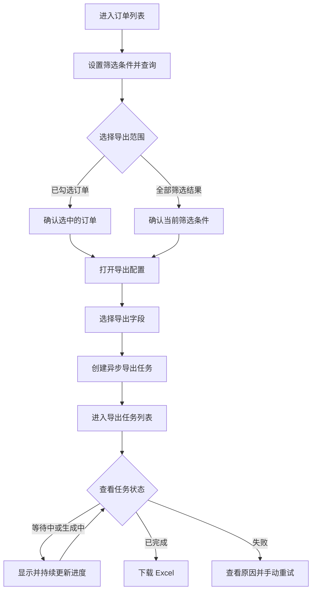

# 产品需求文档：订单异步导出

**创建日期**：2026-09-13

**版本**：1.0.3

**定稿日期**：2026-09-13

**修订日期**：2026-09-21

**修订说明**：验收与成功标准迁移到统一基线；任务进度由固定轮询改为按需 SSE，不使用固定或低频轮询。

**文档目的**：定义订单查询和 Excel 异步导出的产品需求，作为后续产品评审及前端、后端、测试方案编写的共同依据。

**文档归属**：产品需求基线，不属于开发阶段功能规格。

## 1. 背景

订单运营人员经常需要根据下单时间、订单状态和销售渠道等条件筛选订单，并将结果导出为 Excel，用于对账、运营分析或离线处理。

当数据量增大时，在订单列表请求中一次查询全部数据、在内存中构造文件并通过同一个 HTTP 请求返回，容易出现请求超时、服务内存上涨、重复点击生成重复文件以及失败过程不可见等问题。

ExportFlow 需要提供独立、可复用的异步导出闭环。用户在订单列表提交导出后，可在导出任务列表查看任务进度和结果；任务成功后下载 Excel，失败后查看原因并重试。导出任务记录和生成的文件永久保留。

## 2. 产品目标

- 为订单运营人员提供订单筛选、勾选和分页浏览能力。
- 支持导出已选订单或符合当前筛选条件的全部订单。
- 支持单次最多 200,000 条订单数据的 Excel 导出，并在本地环境中于 120 秒内完成上限数据量的文件生成。
- 将耗时导出与订单列表请求解耦，使用户能够持续查看任务状态和处理进度。
- 使用幂等标识防止重复提交产生重复任务和重复文件。
- 让导出失败和不可执行操作对用户可见且可理解。

## 3. 目标用户与使用场景

### 3.1 目标用户

订单运营人员，包括需要进行对账、运营分析或离线处理的业务用户。

### 3.2 核心场景

1. 用户按条件查询订单并分页查看结果。
2. 用户跨一个或多个页面勾选订单，并导出所选订单。
3. 用户将符合当前筛选条件的全部订单导出，不受列表当前页限制。
4. 用户在导出任务列表查看任务状态和进度。
5. 用户下载已完成的 Excel 文件。
6. 用户查看失败原因并手动重试。

## 4. 端到端流程



## 5. 用户故事与验收场景

以下链接中的新增标准仍待后续功能规格整体审批；尤其活跃优先默认排序与已确认排序存在冲突，评审前以已确认的创建时间排序为准。具体状态见 [`acceptance-criteria.md`](acceptance-criteria.md) 和 [`decisions-pending.md`](../decisions-pending.md)。

### 5.1 用户故事一：查询和浏览订单（P1）

作为订单运营人员，我希望按业务条件筛选订单并分页查看结果，以便定位需要分析或导出的订单。

验收标准：[`AC-001`](acceptance-criteria.md#ac-001)、[`AC-002`](acceptance-criteria.md#ac-002)、[`AC-003`](acceptance-criteria.md#ac-003)、[`AC-004`](acceptance-criteria.md#ac-004)、[`AC-005`](acceptance-criteria.md#ac-005)、[`AC-020`](acceptance-criteria.md#ac-020)、[`AC-021`](acceptance-criteria.md#ac-021)、[`AC-022`](acceptance-criteria.md#ac-022)、[`AC-023`](acceptance-criteria.md#ac-023)、[`AC-024`](acceptance-criteria.md#ac-024)、[`AC-033`](acceptance-criteria.md#ac-033)、[`AC-034`](acceptance-criteria.md#ac-034)、[`AC-035`](acceptance-criteria.md#ac-035)。

### 5.2 用户故事二：创建订单导出任务（P1）

作为订单运营人员，我希望导出已选订单或全部筛选结果，以便将所需订单用于对账、分析或离线处理。

验收标准：[`AC-006`](acceptance-criteria.md#ac-006)、[`AC-007`](acceptance-criteria.md#ac-007)、[`AC-008`](acceptance-criteria.md#ac-008)、[`AC-009`](acceptance-criteria.md#ac-009)、[`AC-010`](acceptance-criteria.md#ac-010)、[`AC-011`](acceptance-criteria.md#ac-011)、[`AC-019`](acceptance-criteria.md#ac-019)、[`AC-025`](acceptance-criteria.md#ac-025)、[`AC-030`](acceptance-criteria.md#ac-030)。

### 5.3 用户故事三：跟踪并下载导出结果（P1）

作为订单运营人员，我希望查看导出任务的状态和进度，并在任务完成后下载文件，以便掌握耗时导出的处理结果。

验收标准：[`AC-012`](acceptance-criteria.md#ac-012)、[`AC-013`](acceptance-criteria.md#ac-013)、[`AC-014`](acceptance-criteria.md#ac-014)、[`AC-015`](acceptance-criteria.md#ac-015)、[`AC-026`](acceptance-criteria.md#ac-026)、[`AC-027`](acceptance-criteria.md#ac-027)、[`AC-028`](acceptance-criteria.md#ac-028)、[`AC-031`](acceptance-criteria.md#ac-031)、[`AC-037`](acceptance-criteria.md#ac-037)、[`AC-038`](acceptance-criteria.md#ac-038)、[`AC-039`](acceptance-criteria.md#ac-039)、[`AC-040`](acceptance-criteria.md#ac-040)、[`AC-042`](acceptance-criteria.md#ac-042)、[`AC-043`](acceptance-criteria.md#ac-043)、[`AC-044`](acceptance-criteria.md#ac-044)。[`AC-036`](acceptance-criteria.md#ac-036) 是待产品决策的候选排序，不属于当前默认排序要求。

### 5.4 用户故事四：处理失败任务（P2）

作为订单运营人员，我希望了解任务失败的原因并重新创建任务，以便恢复导出工作。

验收标准：[`AC-016`](acceptance-criteria.md#ac-016)、[`AC-017`](acceptance-criteria.md#ac-017)、[`AC-018`](acceptance-criteria.md#ac-018)、[`AC-032`](acceptance-criteria.md#ac-032)。

### 5.5 用户故事五：处理无效地址（P2）

作为学习项目的使用者，我希望误入无效地址时能够返回业务页面，而不是看到空白页面。

验收标准：[`AC-029`](acceptance-criteria.md#ac-029)、[`AC-041`](acceptance-criteria.md#ac-041)。

## 6. 订单列表页面需求

### 6.1 页面结构

业务页面名称为“订单管理”，页面内容仍为订单列表，由筛选区、操作区、表格区和分页区组成；本期不新增订单创建、编辑或删除能力。另一业务页面为“导出任务”，本期仅这两个业务页面。

### 6.2 筛选区

| 筛选条件 | 说明 |
| --- | --- |
| 关键字 | 不区分英文大小写匹配订单号、客户姓名或手机号，并与其他条件使用“并且”关系；待订单页面规格整体审批 |
| 订单号 | 精确匹配订单号 |
| 订单状态 | 使用 8.1 节订单状态枚举 |
| 销售渠道 | 使用 8.2 节销售渠道枚举 |
| 下单时间范围 | 使用 `Asia/Hong_Kong`，包含精确到秒的开始时间和结束时间 |
| 最小金额 | 订单金额下限，包含边界 |
| 最大金额 | 订单金额上限，包含边界 |

规则：

- 多个筛选条件同时填写时，按“并且”关系组合查询。
- 开始时间不得晚于结束时间。
- 最小金额不得大于最大金额。
- 首版合成订单统一使用 `CNY`，金额保留两位小数；前后端使用十进制定点字符串传输，不进行跨币种换算。

### 6.3 操作区

| 操作 | 行为 |
| --- | --- |
| 查询 | 根据当前筛选条件查询订单，并返回第一页 |
| 重置 | 清空全部筛选条件、已选订单和查询结果状态，恢复第一页及每页 20 条，并立即查询无筛选条件的第一页 |
| 导出已选 | 打开导出配置，为用户勾选的订单选择导出字段并创建任务；没有勾选订单时禁用 |
| 导出筛选结果 | 打开导出配置，为符合当前筛选条件的全部订单选择导出字段并创建任务，不受当前页限制；结果为空时禁用 |

### 6.4 表格区

表格按以下顺序展示字段：

1. 选择框
2. 订单号
3. 客户姓名
4. 客户手机号
5. 状态
6. 渠道
7. 金额
8. 币种
9. 地区
10. 下单时间

状态和渠道在页面中显示中文名称；金额和币种共同表达订单金额。

列表默认按下单时间倒序、再按订单唯一 ID 倒序排列。

### 6.5 分页区

- 展示当前页、每页数量和查询结果总条数。
- 每页数量可选择 20、50、100，默认每页 20 条。
- 修改每页数量后返回第一页。

### 6.6 勾选规则

- 切换分页时保留已勾选订单。
- 修改筛选条件并重新查询时清空已勾选订单。

## 7. 导出任务需求

导出任务页面提供关键字搜索、状态筛选、任务表格和分页。关键字匹配任务编号或文件名；状态筛选包含“全部”、等待中、生成中、已完成和失败。搜索或筛选后从第一页查询，“全部”不附加状态条件；关键字搜索待任务页面规格整体审批。

### 7.1 导出任务列表字段

| 字段 | 说明与展示规则 |
| --- | --- |
| 任务编号 | 对用户可见且唯一，例如 `EXP20260722-6F4A2C8D` |
| 文件名 | 按“订单导出_创建时间_任务编号.xlsx”生成，例如 `订单导出_20260722-153045_EXP20260722-6F4A2C8D.xlsx` |
| 导出范围 | 显示“已选订单 N 条”或“筛选结果 N 条” |
| 状态 | 等待中、生成中、已完成、失败 |
| 进度 | 显示“已处理条数 / 总条数”及百分比；等待中显示 `0 / N` |
| 创建时间 | 用户提交导出任务的时间 |
| 结束时间 | 任务成功或失败的终止时间；未结束时为空 |
| 文件大小 | 仅在任务完成且文件可下载时展示 |
| 错误摘要 | 任务失败时展示用户可理解的信息 |
| 操作 | 根据任务状态提供下载或重试；不可用操作须禁用并说明原因 |

任务列表默认按创建时间倒序、再按任务唯一 ID 倒序排列。服务端分页默认每页 20 条，可选择 20、50、100；修改每页数量后返回第一页。SSE 进度更新保留当前页，重试创建新任务后返回第一页。

### 7.2 状态约束

| 当前状态 | 中文展示 | 允许动作 | 禁止动作 |
| --- | --- | --- | --- |
| `PENDING` | 等待中 | 查看任务信息 | 下载、重试 |
| `RUNNING` | 生成中 | 查看任务信息和处理进度 | 下载、重试 |
| `SUCCEEDED` | 已完成 | 查看任务信息、下载文件 | 重试 |
| `FAILED` | 失败 | 查看任务信息和错误摘要、重试 | 下载 |

### 7.3 状态转换

```text
PENDING -> RUNNING -> SUCCEEDED
                   -> FAILED
```

失败任务执行“重试”时，系统按原任务的导出范围和字段配置创建一个具有新任务编号的任务。原失败任务记录保留，不回退或覆盖原任务状态。

## 8. 业务枚举

### 8.1 订单状态

| 枚举值 | 中文展示 | 含义 |
| --- | --- | --- |
| `PENDING` | 待支付 | 订单已创建但尚未支付 |
| `PAID` | 已支付 | 支付成功，等待发货 |
| `SHIPPED` | 已发货 | 商品已交付物流 |
| `COMPLETED` | 已完成 | 订单已完成 |
| `CANCELED` | 已取消 | 订单已取消 |

### 8.2 销售渠道

| 枚举值 | 中文展示 |
| --- | --- |
| `WEB` | Web 商城 |
| `APP` | 移动 App |
| `STORE` | 线下门店 |
| `PARTNER` | 合作渠道 |

### 8.3 枚举展示规则

- 页面筛选项和订单列表使用中文名称。
- Excel 使用与订单列表相同的中文展示值。
- 系统遇到无法识别的枚举值时，页面和 Excel 均显示“未知”。
- `CANCELED` 是正式枚举值，采用单 `L` 拼写。

## 9. 导出文件要求

- 文件格式为 `.xlsx`。
- 文件内容必须与创建任务时确定的导出范围一致。
- “导出已选”仅包含任务创建时已经选择的订单。
- “导出筛选结果”包含任务创建时符合筛选条件的全部订单，不受分页限制。
- 用户创建任务前自行勾选导出字段；可选字段为订单列表中展示的九个业务字段，不包含选择框。
- 打开导出配置时默认勾选全部九个字段。
- 用户必须保留至少一个导出字段；只剩一个已勾选字段时，该字段不可取消。
- 导出文件的字段、列顺序、表头及字段值使用订单列表页面的展示口径，并与用户选择一致。
- 下单时间按 `Asia/Hong_Kong` 时区格式化为 `yyyy-MM-dd HH:mm:ss`。
- 客户姓名和客户手机号按页面原值导出，不进行脱敏。
- 文件名格式为 `订单导出_{yyyyMMdd-HHmmss}_{任务编号}.xlsx`，其中时间为任务创建时间，并按 `Asia/Hong_Kong` 时区格式化。
- 单个任务必须支持十万条以上且最多 200,000 条订单。
- 导出范围超过 200,000 条时不得创建任务，并提示当前数据量、单次上限以及调整方式。
- 所有导出任务记录和成功生成的文件永久保留，系统不设置自动过期或清理机制。

## 10. 异常与边界情况

- 查询结果为空时，不允许创建“导出筛选结果”任务。
- 未勾选订单时，不允许创建“导出已选”任务。
- 导出范围超过 200,000 条订单时，不允许创建导出任务。
- 携带同一 `Idempotency-Key` 的重复创建请求只能对应一个任务，不得产生重复文件。
- 任务失败时必须保留可理解的错误摘要，并允许符合条件的用户重试。
- 导出配置中必须至少选择一个字段；仅剩一个已选字段时不得继续取消。
- 用户刷新页面或离开页面不影响任务在后台继续执行。
- 导出任务页面存在活跃任务时使用唯一 SSE 连接更新进度，不使用固定或低频轮询。后端发送有效 `stream-idle` 后前端主动关闭；创建/重试成功、进入或恢复页面、恢复联网、手动刷新或同浏览器跨标签页通知时执行一次快照查询，发现活跃任务后重新连接。
- 接口时间统一使用 UTC ISO 8601 字符串（带 `Z`）；页面、Excel 和文件名统一使用 `Asia/Hong_Kong` 时区展示。
- 本项目定位为本地学习项目，使用合成数据；本期不引入登录、认证授权、权限审计、生产监控或合规评审，不修改任务和文件永久保留要求。
- 合成订单在初始化后只读，本期不提供会改变订单筛选结果的数据写入入口。
- 创建导出任务成功后自动进入导出任务页面并清空订单勾选；创建失败时保留筛选条件、导出字段和订单勾选。
- 本期不提供离开页面后的完成通知；用户重新进入导出任务列表时查看最新状态。
- 本期不区分用户角色，不设置基于角色的任务查看和导出限制。
- 客户姓名和手机号在页面及 Excel 中按原值展示，不进行脱敏。

## 11. MVP 可度量目标

MVP 的唯一成功标准定义为 [`SC-001`](acceptance-criteria.md#sc-001)、[`SC-002`](acceptance-criteria.md#sc-002)、[`SC-003`](acceptance-criteria.md#sc-003)、[`SC-004`](acceptance-criteria.md#sc-004)、[`SC-005`](acceptance-criteria.md#sc-005)、[`SC-006`](acceptance-criteria.md#sc-006) 和 [`SC-007`](acceptance-criteria.md#sc-007)。验证环境、用例和证据遵守 [`testing.md`](../rules/testing.md)。

## 12. 待确认事项

按需 SSE 已确定替代轮询；具体连接参数、后端实现和其他未决项统一记录在 [`docs/decisions-pending.md`](../decisions-pending.md)，不得在实现中隐式决定。

## 13. 后续文档关系

本文 `1.0.0` 版本是首个正式产品需求基线，当前版本为 `1.0.3`。后续前端、后端和测试文档均以当前版本和 [`acceptance-criteria.md`](acceptance-criteria.md) 为上游依据；产品需求发生变化时，应先更新二者并升级版本号，再同步调整下游文档。
