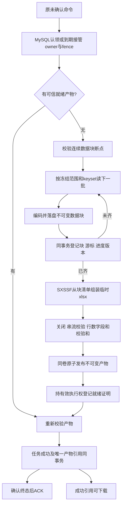

# Excel 生成、异常恢复与文件下载设计

**日期／版本**：2026-10-07／草稿 0.3。负责人已明确本次规格包含真实 Excel；本文只作设计，不产生实现或测试代码。由 [plan](plan.md) 直接引用，与 [spec](spec.md)、[tasks](tasks.md)、[函数清单](function-design.md) 一并审批。架构来源为已接受技术栈及 [ADR-0008](../../docs/adr/0008-worker-execution-lease-and-recovery.md) 已接受的执行恢复子集；批准依据见[决策记录](decision-record.md)，规格整体仍待审。

## 已确定范围与设计决策

已确定需求是实际消费、真实 SXSSF 生成、状态／元数据提交及下载。生成器不能再是空函数。本地同主机访问同一配置持久目录；租约认领、心跳、异常有界接管、数据块断点、就绪产物对账及清理资格构成同一评审包。用户暂停／显式恢复、跨主机共享存储、SSE 和 Redis 实际缓存不属于本期；不能分离接受“开启消费者”却省略长任务故障边界。

接口与模型分别见 [HTTP](contracts/http-api.md)、[Worker](contracts/worker-boundary.md)、[data-model](data-model.md)。验收关联仅链接到 [`AC-013`](../../docs/product/acceptance-criteria.md#ac-013)、[`AC-014`](../../docs/product/acceptance-criteria.md#ac-014)、[`AC-015`](../../docs/product/acceptance-criteria.md#ac-015)、[`AC-018`](../../docs/product/acceptance-criteria.md#ac-018)、[`AC-049`](../../docs/product/acceptance-criteria.md#ac-049)、已确认 [`AC-067`](../../docs/product/acceptance-criteria.md#ac-067)、[`AC-068`](../../docs/product/acceptance-criteria.md#ac-068)、[`AC-069`](../../docs/product/acceptance-criteria.md#ac-069)；完整定义不在本文复制。

## 本期具体建议参数

| 参数 | 已定值／理由 | 验证要求 |
| --- | --- | --- |
| sourceBatchSize | 1000行；限定源读取与块编码内存 | 110000和200000行，最坏字段长度及SELECTED查询 |
| sxssfRowWindow | 100行，inline字符串、压缩POI临时数据；样式固定共享 | 避免shared strings随客户值增长；不逐行建样式或autoSize全表扫描 |
| streamBufferBytes | 65536；限制块和文件读写缓冲 | 真实磁盘性能及堆512MB全量压力 |
| consumerConcurrency / prefetch | 1 / 1，本期同主机基础演示；配置可扩展，扩展前测容量 | 未确认消息长时间占用，重复与失权跨实例测试仍必需 |
| claimTimeout | 5秒，仅监测交付后未认领 | MySQL认领提交不明与通道关闭竞态，不误关正常RUNNING |
| executionLease / heartbeat | 30秒 / 5秒；统一DB时间，续租不能复活过期身份 | 进程kill、心跳拒绝／不明、旧进程迟到 |
| maxAttemptDuration / maxRecoveryTakeovers | 单次5分钟 / 最多3次异常接管；首次不扣预算 | 预算在获得接管权的事务中扣减，竞争失败不扣，进程反复崩溃最终收口 |
| recoveryBackoff | 1～30秒指数退避全抖动，DB持久nextRecoveryAt | lease到期及退避同时满足；不在本地sleep中占消费槽无界等待 |
| brokerConsumerAckTimeout | 10分钟，高于单次尝试及停止宽限；按RabbitMQ3.13实际机制核对 | 不能用5秒claimTimeout配置；broker整分钟检测不当秒级执行定时器 |
| shutdownGrace | 15秒；先停新消费并保存安全断点，再停止续租与通道 | 生成器guard／文件IO要可中止，未停线程不能提前释放执行权 |
| orphanGrace / cleanupBatch | 24小时 / 20条；只清DB裁决无引用残留 | 成功文件／断点引用永久保护，采用与清理串行裁决，不按年龄直接rm |

上述数值已按负责人本次授权定稿，不是已测结论。参考环境与POI精确版本见[决策记录](decision-record.md)和[版本表](dependency-versions.md)；Windows原子移动能力仍需真实验证。产品投递十分钟／五秒扫描固定值保持原定义。

## 生成调用顺序



就绪／断点／业务终态必须先回读数据库，文件存在不能证明提交成功。所有长期文件写入与校验在事务外；只在短事务内裁决权利、登记引用和推进版本。ACK留在最终终态，异常恢复依赖原命令重交付，不扫描RUNNING创建新命令。

## 数据读取与块断点

- Source `OrderRepository.readBatch(taskId,scope,after,limit)` 使用 `(created_at,id)` DESC keyset，固定与默认产品顺序一致；字段选择不改变订单集合；SELECTED查询通过taskId连接已固定关联表，避免每批传200000 IDs。FILTERED复用相同筛选片段。源已初始化只读，可证明重读无业务副作用；若允许写订单，必须重新评审数据快照。
- `OrderBatch`返回最多batchSize行和末条游标。读空即结束；总数、连续块累计和任务受理计数必须一致，不一致明确失败，不能悄悄成功。数据库每次只读批次，分页读取后释放连接，不把生成时间包在读事务内。
- 一个块包含 `formatVersion=1`、配置摘要、数据代次、块序号、前游标／后游标、行数和有序原始字段值。格式为UTF-8 JSON Lines，首行元数据，数据行有序字符串／枚举值；独立文件SHA-256和字节数在数据库登记。编码器限定每行/块字节预算（1MiB/16MiB），超限返回明确错误，不截断客户值。
- 先写attempt独立 `.part`、关闭并force内容，再原子移动到不可变块身份；再同事务检查owner/fence、未过期lease、dataGeneration及expectedCheckpointVersion，登记BlockRef+游标+实际计数，推进检查点和版本。登记不明先按blockId回读，不能删除可能已引用的块。
- `processedCount`等于已可信登记的数据条数；percentage采用floor(100×processed/total)，非成功最高99，只有SUCCEEDED为100。收集齐后组装和校验仍处于RUNNING；失败保留真实计数。进度不能根据内存行数或SXSSF窗口推测。
- 恢复逐块核对版本、配置摘要、序号、前后游标、累计行数、字节数和SHA，只采用可信连续前缀。末块不完整可退回前缀重读；恢复展示计数不回退，记录processedHighWater与独立verifiedPrefixCount。只有失败终态保留高水位且错误描述明确数据校验失败，不能将高水位当成可续写游标。
- 全部可信断点不可用但可安全重复时，事务内新建dataGeneration并保留旧引用待核对；不重置taskId/fence版本，不混合代次。新代次从头收集，前端高水位不倒退，真实成功前必须证明新代次行数完全一致。暂时存储不可访问是依赖UNKNOWN，不立刻当损坏重建。

## SXSSF内容与资源

`PoiExportFileGenerator`取得可信完整块清单，按块序流式读，每次仅保留一行输出及受控缓冲。一个工作簿、一个“订单”工作表、第一行表头，按用户字段列表顺序生成。订单号、客户姓名、手机号、枚举中文、金额两位字符串、CNY、地区、香港时间均按页面展示口径；金额写定点文本以避免Excel/Java double精度损失，订单号与手机号始终文本，保留前导零。使用STRING单元格，不能把`= + - @`开头原值转公式，不对客户原值加前缀或脱敏。未知枚举为“未知”。

字段与表头映射在独立ExcelRowProjector，API/领域不引用POI。单元格超过Excel32767字符限制、非法控制字符或数据不符合约束返回安全失败，不静默截断或剔除；合成夹具明确覆盖这些情况。行号包含表头但rowCount只计业务行；固定列宽、冻结首行、复用少量样式，不保留逐单元格装饰对象或完整字符串共享表。

负责人追加要求写入期间将已完成部分存入临时文件，全部完成后临时结果改为正式结果，本期明确按此实现。SXSSF在100行窗口外持续写入本工作簿的磁盘临时sheet文件；每个数据块写完再显式调用`flushRows(0)`与`flushBufferedData()`，将本批已完成行和缓冲刷出，释放行内存。临时文件在生成期间包含已完成部分，不能只在内存累积到最后。

数据全部写完后，调用一次`workbook.write`将这些临时sheet数据串流封装到attempt下的`.xlsx.part`。XLSX是ZIP容器，逐批重复write/追加不是合法续写方式；生成期间的sheet临时文件与最终待发布`.xlsx.part`职责不同。关闭全部输出、校验并force完成后，以同卷原子移动将该待发布结果改名为正式`.xlsx`；移动或校验失败时不登记READY、不提交成功、不提供下载，仍保留可信恢复数据。正式文件物理存在后仍须完成READY及唯一成功引用事务才可下载。

SXSSF私有临时文件不作跨进程断点。组装中断保留已登记的数据块，并用新attempt重新装配。工作簿、sheet临时文件、输出流使用结构化关闭；close与dispose异常分别记录，不能清理其他attempt的数据块。POI临时目录在进程启动时固定为受控scratch，禁止每任务改全局TempFile策略；同一进程所有POI文件可识别、由当前工作簿dispose。崩溃残留scratch只有确认对应进程/attempt停止且无引用后清理。具体刷盘函数见[函数清单](function-design.md)，实际故障验证见[tasks](tasks.md)。

文件校验采用Apache POI OPCPackage/XSSFReader+SAX流式读取，禁止为了校验用XSSFWorkbook全量加载。检查ZIP可读、单工作表、预期表头/顺序、每行列数、业务行数、文本金额/时区/枚举结构、字符串而非公式单元格；测试再用固定源逐行比对内容。SHA-256流式计算，产物校验完成才允许READY。

## 文件身份、就绪登记及下载

```text
{configuredRoot}/
├── tasks/{taskId}/data/{dataGeneration}/blocks/{blockId}.jsonl
├── tasks/{taskId}/attempts/{fence}-{owner}/staging/{artifactId}.xlsx.part
├── tasks/{taskId}/artifacts/{artifactId}.xlsx
└── scratch/{processInstanceId}/
```

根目录外部配置，不在仓库提交绝对路径。逻辑引用只使用服务端UUID和合法枚举；resolve normalize后须位于root，拒绝符号链接／Windows reparse逃逸，不能用HTTP文件名拼路径。就绪文件publish同卷ATOMIC_MOVE且无覆盖目标；不支持时明确失败并阻止该存储被启用，不偷偷改为可观察半成品的复制。文件内容force不宣称Windows目录元数据已具备宿主断电级保证，本期承诺进程退出/重启窗口，宿主磁盘灾难损坏不自动恢复成功文件。

artifactId、taskId、dataGeneration、configurationHash、rowCount、size、checksum、逻辑引用和humanFileName构成就绪证明。生成者持有效owner/fence时事务登记READY；文件已存在但无证明为残留。接管者核对可信READY及真实文件，重新校验后可用新fence采用，成功与唯一resultArtifactId同事务提交；旧执行者不能覆盖选中的文件或登记新引用。成功提交不明先回读，不删候选产物或写FAILED。

人类文件名 `订单导出_{yyyyMMdd-HHmmss}_{taskNo}.xlsx` 中时间为受理createdAt按Asia/Hong_Kong，不是生成完成时间；物理身份永不依赖人类文件名。成功记录和结果产物永久保留；只清理经DB裁决无有效attempt、无断点／就绪／成功引用且过grace的孤儿。采用与清理先取得同一候选行锁，cleanup状态阻止采用；正常扫描不会直接按文件年龄递归删除。未登记的磁盘孤儿须先登记清理候选、核对owner/fence失效及所有引用再删除，不能用无锁目录扫描判断安全。

下载 `GET /api/v1/export-tasks/{taskId}/file`：短只读核对SUCCEEDED、resultArtifactId和元数据→安全resolve→核对实际可读、大小及存储中已校验的证明→以文件流响应；不在HTTP流期间持有DB事务/租约。Content-Type为xlsx MIME，Content-Length精确，Content-Disposition使用安全ASCII fallback与UTF-8 filename*，清除CR/LF危险字符。非成功409，任务不存在404，成功引用实际文件缺失返回410并告警，不能借此删除成功记录或自动重跑；DB不可读503。文件权限失败安全500，不返回物理路径。前端直接同源anchor，禁用理由可见，不fetch Blob。

## 异常执行与竞态裁决

| 场景 | 拟实现处理 |
| --- | --- |
| 首次竞争认领 | 只有一个PENDING→RUNNING+lease提交者执行；认领不明先回读，未确认不生成 |
| 重复RUNNING消息 | 有效租约保持原执行者；当前delivery HOLD且有界关闭通道以回交broker，不能把RUNNING直接ACK为终态 |
| Worker进程kill／租约失效 | 原命令broker重交付；lease过期且nextRecoveryAt到期后MySQL条件接管，新owner/fence，异常预算事务扣减；无RUNNING扫描补投 |
| 心跳失败或结果不明 | 旧执行者停止新读/写/登记，核对后受控关闭通道；旧owner不能以迟到心跳复活 |
| 单个执行尝试超过5分钟 | 监督器停止本地执行后关闭通道并停止续租，由原命令进入过期接管；不能按本地超时直接覆盖新owner为FAILED |
| 数据块落盘后登记前崩溃 | 无引用块为候选残留；从已提交连续断点继续，不把文件存在当进度 |
| 组装或发布后就绪登记前崩溃 | 已登记块可复用；无可信READY的xlsx不盲目采用；新attempt可重组装 |
| READY登记后成功前崩溃 | 新owner重新核对并采用可信不可变产物，避免再次生成有效结果 |
| 成功提交后ACK丢失 | 重交付读权威终态后ACK，不生成第二个有效产物 |
| 存储暂不可读／DB不可用 | UNKNOWN，保持引用和命令，不删除、不中断事实源裁决；恢复后核对 |
| 明确不可恢复／异常预算耗尽 | 共同task/execution锁序下确认本次合法裁决权→FAILED+结束时间+安全错误→提交后ACK；预算耗尽可在lease过期的接管裁决事务内失败，不凭旧owner报错 |

已定失败码：EXPORT_SOURCE_CHANGED、EXPORT_CELL_INVALID、EXPORT_STORAGE_FULL、EXPORT_FILE_INVALID、EXPORT_RECOVERY_EXHAUSTED、EXPORT_CHECKPOINT_INVALID。诊断日志不记客户、完整载荷或物理路径。数据库、MQ、临时存储不可访问属于依赖故障，先核对与有界恢复，不能用异常名直接宣称业务已失败；长期依赖不可用时终态提交可延迟，恢复后再裁决。新建与幂等重放不自动替用户重试失败任务，原终态永久保留。

## 验证与审批

真实Excel内容/可打开/200000上限/性能/资源、成功元数据、失败实际进度、下载头/路径、重复命令、旧身份、kill窗口、READY/断点/成功提交不明和清理竞态必须在 [tasks](tasks.md) 映射。硬件与参数已定稿，执行恢复子集已接受；依赖与文件系统能力未验证时不能开启实际消费。负责人本次批准的是技术/产品决策，规格与测试阶段仍未批准；本文件不能被解释为代码授权。
