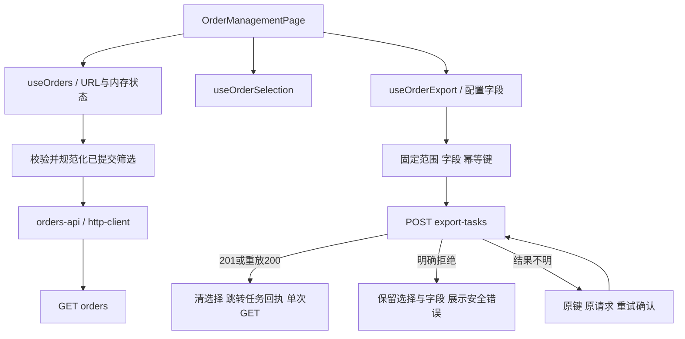
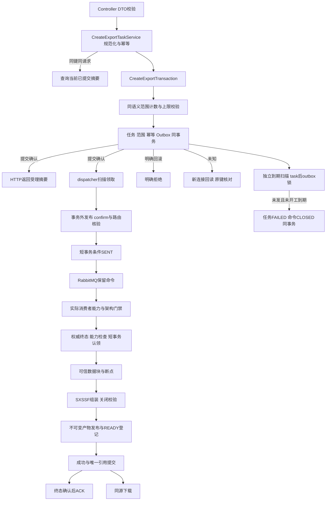

# 实施计划：订单管理与后端异步流程

**功能标识**：`002-order-management` | **日期／版本**：2026-10-07／草稿 0.3 | **规格**：[spec.md](spec.md)  
**当前阶段**：文档准备完成待评审；未创建测试或生产实现。尚未新建功能分支。

## 摘要

沿用现有前端骨架，把订单页面改为真实查询／选择／导出申请入口；初始化真实后端，落实学习稿图 2 的事务受理、图 3 的可靠投递、图 6 的队列保留和图 4 的 Worker 应用编排。本次加入真实Excel，采用有界数据批次、不可变块断点与SXSSF流式装配，校验发布后提交唯一成功引用并支持同源直接下载。图5提供单任务MySQL结果回执和手动刷新，SSE/Redis与完整任务列表另规格。真实消费者为本期交付目标，执行权/异常恢复/文件对账子集已按负责人本次决策接受，详见[Excel方案](excel-design.md)。

**目录树、逐文件职责和所有本期新增／修改函数的签名共同构成设计**。完整逐项清单见 [function-design.md](function-design.md)（186 个计划文件或复用／延后项，271 个函数／端口签名条目，包含不同层的同名方法）。不能只评审目录而跳过签名。自有类型见 [data-model.md](data-model.md)，HTTP 机器契约见 [contracts/openapi.yaml](contracts/openapi.yaml)，详细调用和错误语义见 [HTTP](contracts/http-api.md)、[消息](contracts/export-command.md)、[Worker](contracts/worker-boundary.md)。

## 技术背景

| 项目 | 已确认与待确认范围 |
| --- | --- |
| 前端 | 既有 React/TS/Vite/Ant Design/Router 锁定版本复用；已接受 Query/RHF/Zod 选型，新增版本见[版本表](dependency-versions.md)，运行兼容未验证 |
| 后端 | Java 21、Spring Boot 3、Spring MVC、Maven Wrapper、MyBatis、Flyway、MySQL 8.4；Spring Boot3.5.16及依赖矩阵见[版本表](dependency-versions.md) |
| 异步 | RabbitMQ 命令、MySQL Outbox；Redis最新进度缓存是未来接入边界；本期不连接Redis推测状态 |
| 当前运行条件 | 用户确认三类中间件已在Docker启动；2026-10-07只读docker ps核对三个既有容器healthy，见research；本次未连接或修改业务数据 |
| 测试 | 已接受前端Vitest/Testing Library/MSW，无浏览器E2E门禁；后端JUnit/MockMvc/Testcontainers已由ADR-0009接受 |
| 目标与规模 | 订单只读，页大小受限，单任务上限；性能目标引用[规格](spec.md#成功标准)和[验证映射](tasks.md#sc验证映射)，不以mock或一次运行判成功 |
| 运行与交付 | 复用现有服务；schema/vhost、应用端口、精确版本和性能参考环境已在[决策记录](decision-record.md)定稿；本次不新建Compose/CI/发布流程 |

## 宪法检查

| 检查项 | 状态与依据 |
| --- | --- |
| 风险与架构 | 高风险，并发幂等、期限裁决、领取租约；已接受ADR覆盖受理投递；执行权子集依赖[已接受架构子集](../../docs/adr/0008-worker-execution-lease-and-recovery.md) |
| 研究前治理检查 | 已阅读项目治理、产品、规则及架构；仅文档工作，不执行实现 |
| 结构与函数 | 目录／逐文件／函数／类型／调用链均给出；文档自检不构成人类批准 |
| 设计后检查 | 已确认设计与未执行验证分开记录；真实Excel/异常恢复/下载已入范围；完整任务页、SSE/Redis/用户暂停另期；风险回退见下文 |
| 核心与附属产物审批 | 未批准；[tasks](tasks.md#审批记录)记录范围与版本 |
| 测试阶段 | 未开始；测试代码未编写、未执行；不能把容器healthy视为集成环境已验证 |
| 第二门禁 | 未检查／未批准；生产工程、迁移、真实生成及业务适配器均不得提前写入 |

## 项目结构

### 本次实际新增文档

```text
specs/002-order-management/
├── spec.md
├── plan.md
├── tasks.md
├── research.md
├── decision-record.md
├── dependency-versions.md
├── data-model.md
├── function-design.md
├── excel-design.md
├── quickstart.md
└── contracts/
    ├── README.md
    ├── http-api.md
    ├── export-command.md
    ├── worker-boundary.md
    └── openapi.yaml
```

按负责人本次授权同步产品条目、架构接受子集、工程规则、决策记录及精确版本表；没有自动批准规格或实施。以下树是**后续按门禁实施的目标树**，不是现在已生成的文件。没有变化的入口及页面框架列为复用；后续项保留现有注释占位；执行后证据不提前创建。

```text
├── AGENTS.md  [修改（实施后，仅地图）]
├── backend
│   ├── .mvn
│   │   └── wrapper
│   │       └── maven-wrapper.properties  [新增]
│   ├── mvnw  [新增]
│   ├── mvnw.cmd  [新增]
│   ├── pom.xml  [修改占位]
│   ├── README.md  [修改（实施后）]
│   ├── tools/
│   │   └── SeedOrders.java  [新增（生产实施阶段）]
│   └── src
│       ├── main
│       │   ├── java
│       │   │   └── com
│       │   │       └── exportflow
│       │   │           ├── config
│       │   │           │   ├── RuntimeConfiguration.java  [修改占位]
│       │   │           │   └── RuntimeProperties.java  [新增]
│       │   │           ├── dispatch
│       │   │           │   ├── application
│       │   │           │   │   ├── DispatchScheduler.java  [新增]
│       │   │           │   │   ├── OutboxDispatchService.java  [修改占位]
│       │   │           │   │   └── OutboxTimeoutService.java  [新增]
│       │   │           │   ├── domain
│       │   │           │   │   ├── CommandOutbox.java  [修改占位]
│       │   │           │   │   └── DispatchModels.java  [新增]
│       │   │           │   ├── infrastructure
│       │   │           │   │   ├── messaging
│       │   │           │   │   │   ├── ExportCommandCodec.java  [新增]
│       │   │           │   │   │   └── RabbitMqExportCommandPublisher.java  [修改占位]
│       │   │           │   │   └── persistence
│       │   │           │   │       ├── CommandOutboxMapper.java  [修改占位]
│       │   │           │   │       ├── CommandOutboxRecord.java  [新增]
│       │   │           │   │       ├── MyBatisCommandOutboxRepository.java  [修改占位]
│       │   │           │   │       └── OutboxPersistenceMapper.java  [新增]
│       │   │           │   └── port
│       │   │           │       ├── CommandOutboxRepository.java  [修改占位]
│       │   │           │       └── ExportCommandPublisher.java  [修改占位]
│       │   │           ├── ExportFlowApplication.java  [修改占位]
│       │   │           ├── exporttasks
│       │   │           │   ├── api
│       │   │           │   │   ├── ExportTaskApiMapper.java  [新增]
│       │   │           │   │   ├── ExportTaskApiModels.java  [新增]
│       │   │           │   │   └── ExportTaskController.java  [修改占位]
│       │   │           │   ├── application
│       │   │           │   │   ├── CreateExportTaskService.java  [修改占位]
│       │   │           │   │   ├── CreateExportTransaction.java  [新增]
│       │   │           │   │   ├── DownloadExportFileService.java  [修改占位；本期实现]
│       │   │           │   │   ├── ExportRangeService.java  [新增]
│       │   │           │   │   ├── ExportRequestCanonicalizer.java  [新增]
│       │   │           │   │   └── ExportTaskQueryService.java  [修改占位]
│       │   │           │   ├── domain
│       │   │           │   │   ├── ExportField.java  [新增]
│       │   │           │   │   ├── ExportFileModels.java  [新增]
│       │   │           │   │   ├── ExportScope.java  [新增]
│       │   │           │   │   ├── ExportTask.java  [修改占位]
│       │   │           │   │   └── ExportTaskModels.java  [新增]
│       │   │           │   ├── infrastructure
│       │   │           │   │   ├── cache
│       │   │           │   │   │   └── RedisExportProgressCache.java  [后续；本次保留占位]
│       │   │           │   │   ├── file
│       │   │           │   │   │   └── LocalExportFileStorage.java  [修改占位；本期实现]
│       │   │           │   │   └── persistence
│       │   │           │   │       ├── ArtifactMapper.java  [新增；架构决策已确认]
│       │   │           │   │       ├── ArtifactRecord.java  [新增]
│       │   │           │   │       ├── ExportTaskMapper.java  [修改占位]
│       │   │           │   │       ├── ExportTaskPersistenceMapper.java  [新增]
│       │   │           │   │       ├── ExportTaskRecord.java  [新增]
│       │   │           │   │       ├── MyBatisArtifactRepository.java  [新增；架构决策已确认]
│       │   │           │   │       ├── MyBatisExportTaskRepository.java  [修改占位]
│       │   │           │   │       └── MyBatisIdempotencyRepository.java  [新增]
│       │   │           │   └── port
│       │   │           │       ├── ArtifactRepository.java  [新增；架构决策已确认]
│       │   │           │       ├── ExportFileStorage.java  [修改占位；本期实现]
│       │   │           │       ├── ExportProgressCache.java  [后续；本次保留占位]
│       │   │           │       ├── ExportTaskRepository.java  [修改占位]
│       │   │           │       └── IdempotencyRepository.java  [新增]
│       │   │           ├── orders
│       │   │           │   ├── api
│       │   │           │   │   ├── OrderApiMapper.java  [新增]
│       │   │           │   │   ├── OrderApiModels.java  [新增]
│       │   │           │   │   └── OrderController.java  [修改占位]
│       │   │           │   ├── application
│       │   │           │   │   └── OrderQueryService.java  [修改占位]
│       │   │           │   ├── domain
│       │   │           │   │   ├── Order.java  [修改占位]
│       │   │           │   │   └── OrderQuery.java  [新增]
│       │   │           │   ├── infrastructure
│       │   │           │   │   └── persistence
│       │   │           │   │       ├── MyBatisOrderRepository.java  [修改占位]
│       │   │           │   │       ├── OrderMapper.java  [修改占位]
│       │   │           │   │       ├── OrderPersistenceMapper.java  [新增]
│       │   │           │   │       └── OrderRecord.java  [新增]
│       │   │           │   └── port
│       │   │           │       └── OrderRepository.java  [修改占位]
│       │   │           ├── shared
│       │   │           │   ├── api
│       │   │           │   │   ├── ApiErrorResponse.java  [修改占位]
│       │   │           │   │   └── ApiExceptionHandler.java  [修改占位]
│       │   │           │   └── domain
│       │   │           │       ├── BusinessException.java  [新增]
│       │   │           │       └── PageSlice.java  [新增]
│       │   │           └── worker
│       │   │               ├── application
│       │   │               │   ├── ExecutionSupervisor.java  [新增；架构决策已确认]
│       │   │               │   ├── ExportCommandHandler.java  [修改占位；架构决策已确认]
│       │   │               │   ├── ExportDataCollectionService.java  [新增；架构决策已确认]
│       │   │               │   ├── OrphanCleanupService.java  [新增；架构决策已确认]
│       │   │               │   └── TaskExecutionService.java  [新增；架构决策已确认]
│       │   │               ├── domain
│       │   │               │   ├── CheckpointModels.java  [新增]
│       │   │               │   └── ExecutionModels.java  [新增；架构决策已确认]
│       │   │               ├── infrastructure
│       │   │               │   ├── excel
│       │   │               │   │   ├── ExcelFileValidator.java  [新增]
│       │   │               │   │   ├── ExcelRowProjector.java  [新增]
│       │   │               │   │   ├── ExcelWorkbookAssembler.java  [新增]
│       │   │               │   │   └── PoiExportFileGenerator.java  [修改占位；真实SXSSF生成]
│       │   │               │   ├── file
│       │   │               │   │   └── DataBlockCodec.java  [新增]
│       │   │               │   ├── messaging
│       │   │               │   │   └── RabbitMqExportCommandListener.java  [修改占位；架构决策已确认]
│       │   │               │   └── persistence
│       │   │               │       ├── CheckpointMapper.java  [新增；架构决策已确认]
│       │   │               │       ├── CheckpointRecord.java  [新增]
│       │   │               │       ├── ExecutionLeaseRecord.java  [新增；架构决策已确认]
│       │   │               │       ├── MyBatisCheckpointRepository.java  [新增；架构决策已确认]
│       │   │               │       ├── MyBatisTaskExecutionRepository.java  [新增；架构决策已确认]
│       │   │               │       └── TaskExecutionMapper.java  [新增；架构决策已确认]
│       │   │               └── port
│       │   │                   ├── CheckpointRepository.java  [新增；架构决策已确认]
│       │   │                   ├── ExecutionGuard.java  [新增]
│       │   │                   ├── ExportFileGenerator.java  [修改占位]
│       │   │                   ├── ProgressSink.java  [新增]
│       │   │                   └── TaskExecutionRepository.java  [新增；架构决策已确认]
│       │   └── resources
│       │       ├── application.yml  [修改占位]
│       │       ├── db
│       │       │   └── migration
│       │       │       ├── README.md  [修改]
│       │       │       ├── V1__create_orders.sql  [新增]
│       │       │       ├── V2__create_export_tasks_and_outbox.sql  [新增]
│       │       │       ├── V3__create_task_execution.sql  [新增；架构决策已确认]
│       │       │       └── V4__create_export_checkpoints_and_artifacts.sql  [新增；架构决策已确认]
│       │       └── mappers
│       │           ├── ArtifactMapper.xml  [新增；架构决策已确认]
│       │           ├── CheckpointMapper.xml  [新增；架构决策已确认]
│       │           ├── CommandOutboxMapper.xml  [新增]
│       │           ├── ExportTaskMapper.xml  [新增]
│       │           ├── OrderMapper.xml  [新增]
│       │           └── TaskExecutionMapper.xml  [新增；架构决策已确认]
│       └── test
│           └── java
│               └── com
│                   └── exportflow
│                       ├── dispatch
│                       │   ├── OutboxDispatchMySqlTest.java  [新增（仅测试阶段）]
│                       │   ├── OutboxTimeoutMySqlTest.java  [新增（仅测试阶段）]
│                       │   └── RabbitMqPublisherTest.java  [新增（仅测试阶段）]
│                       ├── exporttasks
│                       │   ├── CreateTransactionMySqlTest.java  [新增（仅测试阶段）]
│                       │   ├── ExportCreationContractTest.java  [新增（仅测试阶段）]
│                       │   ├── IdempotencyMySqlTest.java  [新增（仅测试阶段）]
│                       │   └── TaskSnapshotMySqlTest.java  [新增（仅测试阶段）]
│                       ├── orders
│                       │   ├── OrderApiContractTest.java  [新增（仅测试阶段）]
│                       │   └── OrderQueryMySqlTest.java  [新增（仅测试阶段）]
│                       ├── RuntimeConfigurationTest.java  [新增（仅测试阶段）]
│                       └── worker
│                           ├── ArtifactCleanupRaceTest.java  [新增（规格获批后测试阶段）]
│                           ├── CheckpointRecoveryTest.java  [新增（规格获批后测试阶段）]
│                           ├── DownloadExportFileTest.java  [新增（规格获批后测试阶段）]
│                           ├── ExcelContentTest.java  [新增（规格获批后测试阶段）]
│                           ├── ExcelResourceTest.java  [新增（规格获批后测试阶段）]
│                           ├── ExecutionLeaseMySqlTest.java  [新增（仅测试阶段）]
│                           ├── ExportCommandHandlerTest.java  [新增（仅测试阶段）]
│                           ├── ExportProgressMySqlTest.java  [新增（规格获批后测试阶段）]
│                           └── GeneratorBoundaryTest.java  [新增（仅测试阶段）]
├── DATA-FLOW.md  [修改（实施后）]
├── docs
│   └── validation
│       └── 002-order-management
│           ├── coverage-gaps.md  [新增（执行后）]
│           ├── environment.md  [新增（执行后）]
│           ├── excel-content.md  [新增（实际执行后）]
│           ├── excel-performance.json  [新增（实际执行后）]
│           ├── green-results.md  [新增（执行后）]
│           ├── orders-1280x720.png  [新增（执行后）]
│           ├── performance.json  [新增（执行后）]
│           └── red-results.md  [新增（执行后）]
├── frontend
│   ├── package.json  [修改]
│   ├── pnpm-lock.yaml  [修改]
│   ├── README.md  [修改（实施后）]
│   ├── src
│   │   ├── app
│   │   │   ├── app-providers.tsx  [修改]
│   │   │   ├── query-client.ts  [新增]
│   │   │   ├── route-error-fallback.tsx  [复用]
│   │   │   └── router.tsx  [复用]
│   │   ├── features
│   │   │   ├── export-tasks
│   │   │   │   ├── __tests__
│   │   │   │   │   └── task-receipt.test.tsx  [新增（仅测试阶段）]
│   │   │   │   ├── api
│   │   │   │   │   └── export-tasks-api.ts  [修改占位]
│   │   │   │   ├── components
│   │   │   │   │   └── export-task-table.tsx  [后续；本次保留占位]
│   │   │   │   ├── hooks
│   │   │   │   │   └── use-export-tasks.ts  [后续；本次保留占位]
│   │   │   │   ├── models
│   │   │   │   │   └── export-task-schema.ts  [新增]
│   │   │   │   ├── pages
│   │   │   │   │   └── task-management-page.tsx  [修改]
│   │   │   │   └── types
│   │   │   │       └── export-task.types.ts  [修改占位]
│   │   │   └── orders
│   │   │       ├── __tests__
│   │   │       │   ├── order-export.test.tsx  [新增（仅测试阶段）]
│   │   │       │   ├── order-management.test.tsx  [新增（仅测试阶段）]
│   │   │       │   ├── order-query.test.ts  [新增（仅测试阶段）]
│   │   │       │   └── order-selection.test.ts  [新增（仅测试阶段）]
│   │   │       ├── api
│   │   │       │   └── orders-api.ts  [修改占位]
│   │   │       ├── application
│   │   │       │   └── order-export-use-case.ts  [修改占位]
│   │   │       ├── components
│   │   │       │   ├── export-config-dialog.tsx  [修改占位]
│   │   │       │   ├── order-filter-form.tsx  [修改占位]
│   │   │       │   └── order-table.tsx  [修改占位]
│   │   │       ├── hooks
│   │   │       │   ├── use-order-export.ts  [新增]
│   │   │       │   ├── use-order-query-state.ts  [新增]
│   │   │       │   ├── use-order-selection.ts  [新增]
│   │   │       │   └── use-orders.ts  [修改占位]
│   │   │       ├── models
│   │   │       │   ├── order-query.ts  [新增]
│   │   │       │   ├── order-schema.ts  [新增]
│   │   │       │   ├── order-selection.ts  [新增]
│   │   │       │   └── order-view-model.ts  [修改占位]
│   │   │       ├── pages
│   │   │       │   └── order-management-page.tsx  [修改占位]
│   │   │       └── types
│   │   │           └── order.types.ts  [修改占位]
│   │   ├── layouts
│   │   │   ├── admin-layout.tsx  [复用]
│   │   │   └── sidebar-menu.tsx  [复用]
│   │   ├── pages
│   │   │   └── not-found-page.tsx  [复用]
│   │   ├── shared
│   │   │   ├── api
│   │   │   │   ├── api-error.ts  [修改占位]
│   │   │   │   └── http-client.ts  [修改占位]
│   │   │   ├── formatters
│   │   │   │   ├── date-time.ts  [修改占位]
│   │   │   │   └── money.ts  [修改占位]
│   │   │   ├── navigation
│   │   │   │   └── navigation.ts  [复用]
│   │   │   ├── styles
│   │   │   │   └── global.css  [复用]
│   │   │   └── types
│   │   │       └── page-result.ts  [修改占位]
│   │   └── test
│   │       ├── handlers.ts  [新增（仅测试阶段）]
│   │       └── setup.ts  [新增（仅测试阶段）]
│   ├── tsconfig.app.json  [修改]
│   ├── vite.config.ts  [修改]
│   └── vitest.config.ts  [新增]
├── README.md  [修改]
├── scripts
│   ├── check-order-performance.ps1  [新增]
│   └── seed-orders.ps1  [新增]
└── tests
    ├── backend
    │   └── pom.xml  [新增（仅测试准备）]
    └── fixtures
        ├── export-requests.json  [新增（仅测试）]
        ├── orders.sql  [新增（仅测试）]
        └── outbox.sql  [新增（仅测试）]
```

### 逐文件职责与函数设计

[逐文件职责表](function-design.md#逐文件职责清单)逐项说明新增、占位修改、真实修改、复用与后续；[逐函数表](function-design.md#逐函数签名注释与调用)包含参数／返回值／中文注释／流程／调用／错误／任务与测试。无函数的配置、类型、SQL、资源及证据文件也在表中注明内容。Java源码命名采用既有PascalCase类型文件，前端延续kebab-case文件和PascalCase组件；不批量重命名既有文件。

### 前端调用链



筛选／选择／字段与服务端缓存分别有唯一所有者。keyword 不入URL；安全URL只负责非敏感已提交条件。旧请求取消和query key隔离；结果切换中不能把旧total用于新范围。SELECTED导出固定ID，FILTERED固定已提交filter，不带分页与排序。客户端超时只是本次响应未知，不撤销后台事务。

### 后端调用链与失败出口



1. 订单HTTP：OrderController→DTO映射→OrderQueryService→OrderRepository→MyBatis/SQL；未知枚举、范围、精度先校验；查询无写入，不默认缓存。
2. 创建：非事务协调器规范化→已提交幂等快查→独立事务重新核对→范围验证→生成稳定身份→写任务/关联/幂等/Outbox→确认提交才返回。唯一冲突回滚后新事务核对；提交异常无法证明时返回UNKNOWN。RabbitMQ不参与创建事务。
3. 投递：固定task→outbox锁序→锁内数据库时间→领取和attempt/crashRetryAt同事务→事务外publish→confirm+正确目标+保留策略→短事务标SENT；旧token、过期lease、CLOSED拒绝回写。坏记录逐条隔离；共享依赖故障有界退避。
4. 到期：独立线程在启动恢复及每五秒启动扫描→锁内deadline裁决→PENDING且未SENT原子失败并关闭；有效投递lease和较晚nextAttempt不能阻挡。已开工/终态则关闭不再需要的原命令；SENT排除。截止时间不因重启重算。
5. Worker：消息/权威终态→能力→首次认领或过期有界接管→确认提交→READY或断点核对→源批读/块落盘→断点/实际进度同事务→SXSSF流式装配→关闭/SAX校验→原子发布/READY→成功与采用引用同事务→ACK。架构子集已确认，生产任务仍受两次开发门禁约束；单元替身不替代真实文件与kill窗口证据。
6. 回执：GET taskId→MySQL摘要/成功元数据；手动刷新一次，无Redis/SSE/前端定时器。成功anchor→下载Controller→权威resultArtifact→安全resolve/open→释放事务后有界流式响应。

### 数据库与SQL设计边界

逻辑表／索引／规范化见[data-model](data-model.md)。列表offset分页限定page/pageSize且稳定双列；本期生成readBatch真实采用time/id DESC keyset，SELECTED按taskId连接已固定关联表，不在每批传完整ID列表。SELECTED关联分批插入但同事务提交，不能部分成功；countExisting分批汇总且去重，任何缺失整笔拒绝。批量和请求字节上限需在真实200000 ID场景验证，不能设置过小限制破坏上限承诺。

已确定READ COMMITTED与SKIP LOCKED须用真实MySQL验证；候选扫描不授予执行权。固定锁序task→outbox（涉及命令时）→execution→checkpoint→artifact/candidate→attempt，省略只能向后；若用SKIP LOCKED也不能先锁outbox再回锁task。拿到共同裁决锁后再读DB时间。未知提交只回读，不根据异常、缓存或本地时钟断言回滚。SQL文件列全部statement及共享条件，不在本阶段生成可执行迁移或测试夹具。

### 通用能力与仅设计能力

新增共用HTTP client供订单与任务API；错误、金额、UTC/香港格式化供订单与回执；分页类型供协议适配。领域值类型限定本功能，不新增泛化框架。已有导航、Layout、404和错误恢复全部复用，无业务签名修改。

本期真实Excel、批读/数据块断点、就绪文件对账、异常接管、发布与下载见[Excel方案](excel-design.md)与[Worker契约](contracts/worker-boundary.md)，全部关联函数/类型/测试。后续仅Redis/SSE、完整任务列表、失败重试页面、用户暂停/显式恢复及跨主机存储。所有文件性能/资源/准确性指标本期独立验证，不能以无实际运行的方案判通过。

### 测试准备边界

规格批准后可增加前端测试工具与测试文件、tests/backend测试harness和隔离夹具；不得改后端pom为正式工程、添加生产类、正式迁移或POI空实现。已有生产入口缺失导致的编译/导入错误必须登记覆盖缺口；测试harness/独立SQL夹具的成功不能冒充真实生产适配集成，不能以此代替行为红灯。

默认整个规格统一测试阶段审批。只有测试环境正常、用例完整、有真实新增行为失败或明确评审的覆盖缺口，且负责人第二次明确批准后，才可正式初始化后端并实施生产业务。测试进度、阻塞、实际命令与前后结果持续记录在[tasks](tasks.md#测试进度与证据)。

## 高风险回退与运行边界

不新增部署拓扑。运行复用已有Docker服务，项目隔离资源使用前须确认；不修改示例项目数据。停用应用时先停新受理／新领取及消费者，按获批预算核对在途；无证据的发送不标SENT，不删除命令，deadline与历史保持。回退应用保留MySQL表、任务、幂等与队列，Flyway采取向前修复，不执行DROP/TRUNCATE。本期真实长任务停止要保存可信断点、确认执行停止后再协调心跳与通道；不得删除可恢复块、READY或成功结果。Windows文件根/原子移动/POI scratch/清理资格详见Excel方案；关闭消费只是操作步骤，不能代替安全交接。

## 复杂度追踪

当前未请求违反治理门禁的例外。幂等表、尝试表、执行权端口用于已确认并发与诊断边界；执行权架构根据负责人“按你的建议来”明确决策接受子集。全部技术待决已定稿，见[决策记录](decision-record.md)与[精确版本](dependency-versions.md)。规格及测试阶段的两次审批仍未批准；实际环境、兼容和行为验证未执行，不以设计结论替代证据。

## 本期 Excel 逐文件与函数设计入口

[excel-design.md](excel-design.md)集中说明批次/窗口/缓存上限、字符与金额表达、检查点/高水位、断点恢复/安全重建、产物READY/采用、路径与原子发布、下载流及清理互斥。新增函数均在[function-design](function-design.md)逐项列签名；自有类型及新逻辑表在[data-model](data-model.md)。V4迁移与Checkpoint/Artifact XML是本次设计目标，审批前不得生成。任务T-032/T-033/T-034分别对应数据、文件、下载，用例TC-230至TC-236对应实际内容/资源/进度/准确性/下载/恢复/清理。
